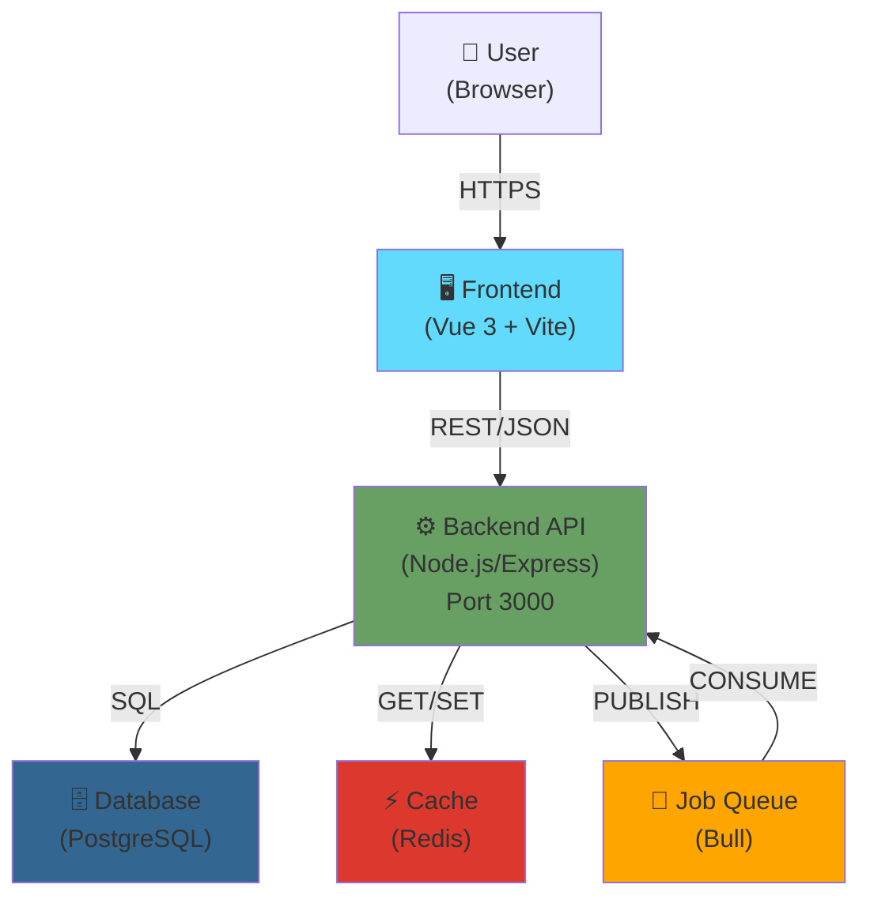
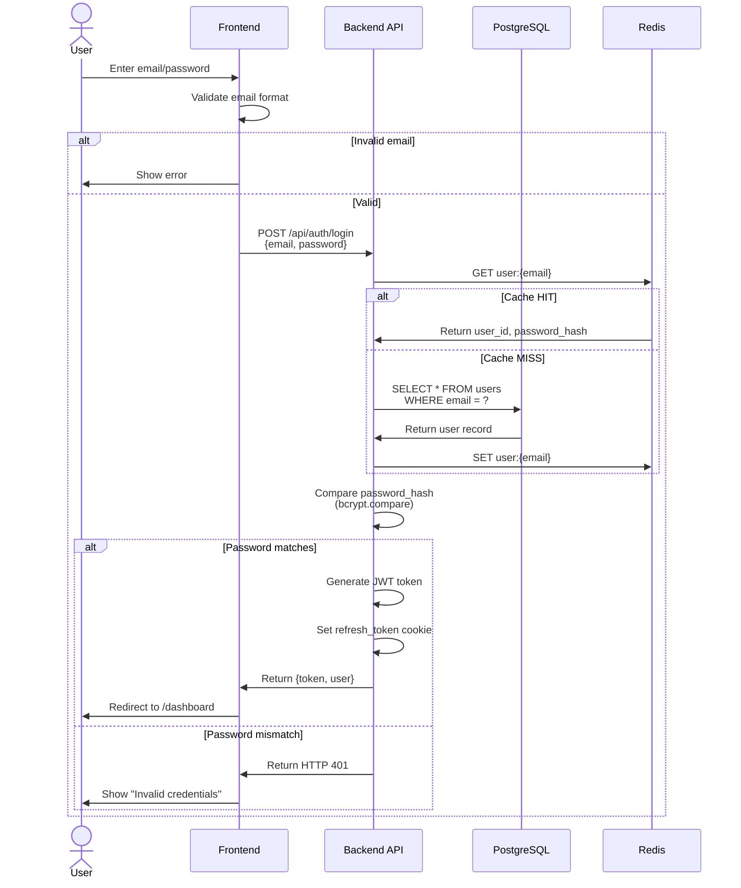
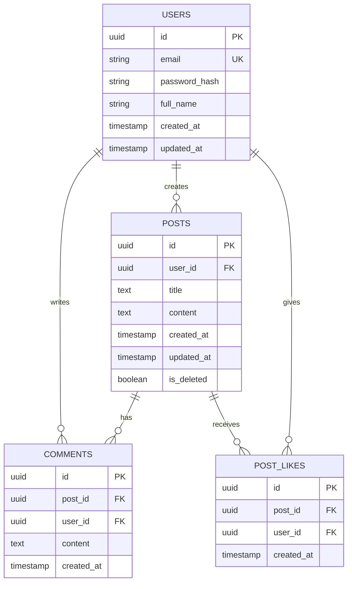

# System Design Checklist — V4 AI-First Framework

**Version**: V4.0 | **Last Updated**: 2026-03-31 | **Gate**: Plan Gate (Mandatory)

---

## Overview

Before **Plan Gate approval**, the system design must be **fully documented and locked**. All 7 items below are **non-negotiable**. Changes to Baselined design require **Change Impact Assessment (CIA)**.

This checklist ensures clarity for:
- **Agents** (Backend, Frontend, DevOps, QA) to work in parallel
- **Reviewers** at Plan Gate to approve the design
- **Team** to understand tradeoffs and constraints

---

## SD-1: Architecture Diagram

### What to Produce

A **single, comprehensive diagram** showing:
- All major modules/services (Backend, Frontend, Database, External APIs)
- Interfaces between modules (REST API, gRPC, message queue, sync/async)
- Technology stack per module (e.g., "Vue 3 + Pinia", "Node.js/Express", "PostgreSQL")
- Deployment boundaries (on-prem vs. cloud, separate containers/processes)

### Format

Choose **one**:
- **Mermaid** (graph TD, flowchart, architecture style) — recommended for versioning in git
- **ASCII diagram** — for simple architectures
- **C4 Model** (Context → Container → Component → Code) — for complex systems

### Acceptance Criteria

- [ ] All major components visible and labeled
- [ ] Every interface has a protocol/technology listed (REST, gRPC, WebSocket, SQL, etc.)
- [ ] Deployment/infrastructure shown (Docker containers, K8s, databases, message brokers)
- [ ] Technology choices justified (if non-standard, reference ADR)
- [ ] Diagram is **readable** at presentation size (no microscopic text)

### Example Snippet

**Mermaid C1 (Context)**:


---

## SD-2: Data Flow Diagram

### What to Produce

For each **core API/user journey**, document:
1. **Request entry point** (HTTP endpoint, event, query)
2. **Processing steps** (service calls, validation, business logic)
3. **Data transformations** (DB fetch, cache hit/miss, aggregation)
4. **Response** (HTTP status, payload, side effects)

### Format

**Mermaid sequence diagram** (one per major flow) or **flowchart**.

### Acceptance Criteria

- [ ] Every core user journey has a flow (e.g., "User Login", "Create Post", "Search Results")
- [ ] Each step labels **what happens** (e.g., "Validate email format", "Query posts table", "Increment view count")
- [ ] Cache behavior explicit (hit/miss paths)
- [ ] Error paths shown (validation failure, 404, timeout, etc.)
- [ ] Async operations marked (background jobs, webhooks, pub/sub)

### Example Snippet

**User Login Flow** (Mermaid Sequence):


---

## SD-3: Database Schema

### What to Produce

1. **Entity-Relationship Diagram (ERD)**: All tables, relationships (1-to-many, many-to-many), cardinalities
2. **DDL (Data Definition Language)**: CREATE TABLE statements with column types, constraints, indexes
3. **Index Strategy**: Which columns are indexed, why (query performance, uniqueness, foreign key)

### Format

- **ERD**: Mermaid `erDiagram`, Lucidchart, or ASCII table
- **DDL**: SQL script (PostgreSQL, MySQL, etc.) with comments

### Acceptance Criteria

- [ ] All entities mapped (e.g., users, posts, comments, likes)
- [ ] Primary keys defined (id, UUIDs, or composite)
- [ ] Foreign keys explicit and labeled
- [ ] Many-to-many relationships use junction tables
- [ ] Indexes on frequently queried columns (WHERE, JOIN, ORDER BY)
- [ ] NOT NULL / UNIQUE constraints documented
- [ ] Soft deletes (is_deleted, deleted_at) if applicable
- [ ] Audit fields (created_at, updated_at) present where needed

### Example Snippet

**ERD** (Mermaid):


**DDL** (PostgreSQL):
```sql
-- Users table
CREATE TABLE users (
    id UUID PRIMARY KEY DEFAULT gen_random_uuid(),
    email VARCHAR(255) NOT NULL UNIQUE,
    password_hash VARCHAR(255) NOT NULL,
    full_name VARCHAR(255),
    created_at TIMESTAMP NOT NULL DEFAULT CURRENT_TIMESTAMP,
    updated_at TIMESTAMP NOT NULL DEFAULT CURRENT_TIMESTAMP
);
CREATE INDEX idx_users_email ON users(email);

-- Posts table
CREATE TABLE posts (
    id UUID PRIMARY KEY DEFAULT gen_random_uuid(),
    user_id UUID NOT NULL REFERENCES users(id) ON DELETE CASCADE,
    title VARCHAR(500) NOT NULL,
    content TEXT NOT NULL,
    created_at TIMESTAMP NOT NULL DEFAULT CURRENT_TIMESTAMP,
    updated_at TIMESTAMP NOT NULL DEFAULT CURRENT_TIMESTAMP,
    is_deleted BOOLEAN NOT NULL DEFAULT FALSE
);
CREATE INDEX idx_posts_user_id ON posts(user_id);
CREATE INDEX idx_posts_created_at ON posts(created_at DESC);

-- Comments table
CREATE TABLE comments (
    id UUID PRIMARY KEY DEFAULT gen_random_uuid(),
    post_id UUID NOT NULL REFERENCES posts(id) ON DELETE CASCADE,
    user_id UUID NOT NULL REFERENCES users(id) ON DELETE CASCADE,
    content TEXT NOT NULL,
    created_at TIMESTAMP NOT NULL DEFAULT CURRENT_TIMESTAMP
);
CREATE INDEX idx_comments_post_id ON comments(post_id);
CREATE INDEX idx_comments_user_id ON comments(user_id);

-- Post Likes table (many-to-many)
CREATE TABLE post_likes (
    id UUID PRIMARY KEY DEFAULT gen_random_uuid(),
    post_id UUID NOT NULL REFERENCES posts(id) ON DELETE CASCADE,
    user_id UUID NOT NULL REFERENCES users(id) ON DELETE CASCADE,
    created_at TIMESTAMP NOT NULL DEFAULT CURRENT_TIMESTAMP,
    UNIQUE (post_id, user_id)
);
CREATE INDEX idx_post_likes_post_id ON post_likes(post_id);
CREATE INDEX idx_post_likes_user_id ON post_likes(user_id);
```

---

## SD-4: State Machine Diagram

### What to Produce

For each **core entity** with complex state, document all valid **transitions**:
- Valid next states from each state
- Conditions/events triggering transitions
- Actions/side effects per transition

### Format

**Mermaid stateDiagram-v2** (recommended) or **UML state diagram**.

### Acceptance Criteria

- [ ] All states enumerated (e.g., for Order: PENDING, PROCESSING, SHIPPED, DELIVERED, CANCELLED)
- [ ] Transitions labeled with **event** and **guard** (condition)
- [ ] No impossible transitions (e.g., DELIVERED → PENDING forbidden)
- [ ] Actions on transitions documented (e.g., "send email", "update cache")
- [ ] Error/fallback states included (e.g., FAILED, UNKNOWN)

### Example Snippet

**Order State Machine**:
```mermaid
stateDiagram-v2
    [*] --> PENDING: Order created

    PENDING --> PROCESSING: Payment verified
    PENDING --> CANCELLED: User cancels\n(before payment)

    PROCESSING --> SHIPPED: Warehouse ships\n(send email)
    PROCESSING --> FAILED: Payment declined\n(notify user)

    SHIPPED --> DELIVERED: Delivery confirmed
    SHIPPED --> RETURNED: User initiates\nreturn

    DELIVERED --> [*]
    CANCELLED --> [*]
    FAILED --> [*]
    RETURNED --> [*]

    note right of PENDING
        Max wait: 15 mins
        Transitions: payment required
    end

    note right of PROCESSING
        Max duration: 24 hrs
        Actions: send notification
    end
```

---

## SD-5: Error Handling Strategy

### What to Produce

1. **Error Code Table**: Mapping of error codes to HTTP status, user message, and recovery
2. **HTTP Status Usage**: When to use 400, 401, 403, 404, 409, 500, etc.
3. **Fallback/Retry Paths**: How to recover from transient vs. permanent failures

### Format

**Markdown table** + prose description of retry logic.

### Acceptance Criteria

- [ ] All error codes in range 1000–9999 (or per company standard)
- [ ] Every error has **user-facing message** and **developer message**
- [ ] HTTP status code **correctly chosen** (see table below)
- [ ] Retry logic explicit (exponential backoff, max retries, which errors are retryable)
- [ ] Logging/alerting defined (which errors trigger alerts?)

### HTTP Status Quick Ref

| Status | Use Case |
|--------|----------|
| **400** | Bad request (invalid JSON, missing required field) |
| **401** | Unauthorized (no token, invalid token, expired) |
| **403** | Forbidden (user authenticated but lacks permission) |
| **404** | Not found (resource doesn't exist) |
| **409** | Conflict (duplicate key, state mismatch) |
| **422** | Unprocessable entity (semantic validation failed) |
| **429** | Too many requests (rate limited) |
| **500** | Internal server error (unexpected exception) |
| **503** | Service unavailable (database down, circuit breaker open) |

### Example Snippet

**Error Code Registry**:
```markdown
| Error Code | HTTP | User Message | Developer Message | Retryable |
|---|---|---|---|---|
| 1001 | 400 | "Email is required" | "Missing 'email' in request body" | No |
| 1002 | 400 | "Invalid email format" | "Email regex failed" | No |
| 2001 | 401 | "Invalid credentials" | "Password hash mismatch or user not found" | No |
| 2002 | 401 | "Token expired" | "JWT exp claim < now" | Yes* |
| 3001 | 403 | "You don't have permission" | "User role insufficient for operation" | No |
| 4001 | 404 | "User not found" | "User ID not in database" | No |
| 5001 | 409 | "Email already registered" | "Unique constraint violation on users.email" | No |
| 9001 | 500 | "Something went wrong" | "Unexpected error: {stack trace}" | Yes (wait 2s, retry 3x) |

*Token expired: Client should refresh token and retry once.

**Retry Strategy**:
- Retryable errors: 2001 (refresh token), 9001 (transient server error), 503
- Non-retryable: 400, 401, 403, 404, 409, 422
- Backoff: Exponential (1s → 2s → 4s), max 3 retries
- Timeout: 30s per request
```

---

## SD-6: Test Matrix

### What to Produce

A **feature × test level** matrix showing:
- Which features have unit tests, integration tests, E2E tests, security tests
- Minimum coverage targets per level
- Tools/frameworks per level (Jest, Pytest, Playwright, OWASP ZAP, etc.)

### Format

**Table** with features as rows, test levels as columns. See TEMPLATE_Test_Matrix.md for details.

### Acceptance Criteria

- [ ] Every feature has L1 (unit) tests planned
- [ ] Critical features have L2 (integration) + L3 (E2E) tests
- [ ] Security-sensitive features (auth, payments) have L4 tests
- [ ] Coverage targets are **realistic and measurable** (not just "100%")
- [ ] Tools/frameworks chosen (test runner, assertion library, mocking)

### Example Snippet

```markdown
| Feature | L1 Unit | L2 Integration | L3 E2E | L4 Security | Tools |
|---------|---------|---|---|---|---|
| User Auth | ✓ (target: ≥80%) | ✓ (happy + error) | ✓ (register → login → protected) | ✓ (SQLi, brute force) | Jest, Playwright, OWASP ZAP |
| Create Post | ✓ (target: ≥75%) | ✓ (DB insert + cache) | ✓ (form → submit → list) | — | Jest, Playwright |
| Search | ✓ (target: ≥70%) | ✓ (full-text search logic) | ✓ (keyword → results) | — | Jest, Pytest (Python), Playwright |
```

---

## SD-7: Architecture Decision Records (ADRs)

### What to Produce

One **ADR per significant decision**:
- Why did we choose Technology X over Y?
- Why REST instead of GraphQL?
- Why PostgreSQL instead of MongoDB?
- Why Redis for caching?

### Format

**ADR template** (as per TEMPLATE_ADR.md or Adr.io standard):
```markdown
## ADR-001: Database Choice — PostgreSQL

### Status: Accepted (Plan Gate: 2026-03-31)

### Context
We need a relational database for user/post data with complex queries and transactions.

### Decision
Use PostgreSQL.

### Consequences
✓ ACID transactions, excellent query optimizer, mature ecosystem
✗ No built-in horizontal sharding (shard via app logic if needed)

### Alternatives Considered
1. MongoDB — simpler schema, but ACID transactions weaker; eventual consistency risk
2. MySQL — similar to PG, slightly lower feature set; chose PG for window functions & JSON support
```

### Acceptance Criteria

- [ ] Every non-obvious tech choice has an ADR
- [ ] ADRs reference each other if related (e.g., ADR-002 depends on ADR-001)
- [ ] Consequences clearly state **pros/cons** and **mitigations**
- [ ] Alternatives explicitly considered and rejected
- [ ] ADR status tracked (Proposed, Accepted, Deprecated, Superseded)

---

## Architecture Lock-in Rule

### Once Baselined → Changes Need CIA

**Timeline**:
1. **Drafting Phase** (pre-Plan Gate): Architecture open, iterate freely
2. **Plan Gate** (Gate 1): Architecture reviewed, approved, **LOCKED**
3. **Build/Release** (P04 onward): Architecture is **Baselined**
4. **Any change** to Baselined architecture: Trigger **Change Impact Assessment (CIA)**

**Impact Examples**:
- Changing database from PostgreSQL → MongoDB: **CIA required** (breaks schema, queries, deployment)
- Adding new service/module: **CIA required** (changes deployment, networking, monitoring)
- Changing API style (REST → GraphQL): **CIA required** (affects all clients)
- Adding cache layer (Redis): **CIA required** (consistency implications, client invalidation)

**Non-Impact** (no CIA):
- Adding new feature that uses existing architecture
- Optimizing existing module (same tech stack)
- Bug fixes

---

## System Design Confirm (SD_CONFIRM)

### Pre-Plan Gate: SD Review & Approval

Once all 7 items above are complete:

1. **Architect**: Self-check all 7 items ✓
2. **Create file**: `/project/01_Intake/SD_CONFIRM.md`
   ```markdown
   ## System Design Confirmation

   **Date**: 2026-03-31
   **Prepared By**: Architect
   **Reviewed By**: (TBD)
   **Approved By**: (TBD)

   ### Checklist
   - [x] SD-1: Architecture Diagram complete & readable
   - [x] SD-2: Data Flow Diagram for all core journeys
   - [x] SD-3: Database Schema (ERD + DDL + Index Strategy)
   - [x] SD-4: State Machine Diagram for core entities
   - [x] SD-5: Error Handling Strategy & HTTP status mapping
   - [x] SD-6: Test Matrix with coverage targets
   - [x] SD-7: All tech choices have ADRs

   ### Architecture Lock-in Acknowledged
   - [ ] Design is **frozen** until Plan Gate approval
   - [ ] Post-Baselined changes require CIA

   ### Reviewer Sign-Off
   **Reviewer**: 凱子 (Product/Architect lead)
   **Date**: [TBD]
   **Feedback**: [TBD]
   **Approved**: [Yes/No]
   ```

3. **凱子 reviews** (Architect/PM):
   - Reads all diagrams, code samples, ADRs
   - Asks clarifying questions if needed
   - Signs off: `Approved: Yes` → **Plan Gate PASS**

4. **If rejected**: Architect revises and resubmits within 24 hrs

---

## Checklist for Gate Reviewers

When reviewing this System Design package:

- [ ] Architecture diagram shows **all components** and **all interfaces**
- [ ] I understand **data flow** for each core journey (login, create, search, etc.)
- [ ] Database schema is **normalized** and **indexed appropriately**
- [ ] State machines are **complete** (no impossible transitions)
- [ ] Error codes are **comprehensive** and status codes are **correct**
- [ ] Test matrix shows **realistic coverage targets** per level
- [ ] All non-obvious choices have **clear ADRs** with tradeoffs documented
- [ ] I can **explain this design** to a new team member in 15 minutes
- [ ] Design is **feasible** with available team/time/budget
- [ ] Design is **scalable** for projected user/data growth
- [ ] No **architectural conflicts** (e.g., monolith + microservices hybrid without clear boundaries)

---

## Common Pitfalls

| Pitfall | Why It's Bad | Fix |
|---------|---|---|
| Architecture diagram has no labels | Can't understand interfaces | Add protocol (REST, gRPC), data format (JSON, Protobuf), sync/async |
| "We'll use microservices" (no DDL) | You don't know schema yet | Require ERD + DDL before approval |
| Error codes all 500 | No semantic info to client | Use specific codes (4001, 5001, etc.) + HTTP status |
| "Test all features" (no targets) | How much is enough? | Set targets per level (L1: ≥80%, L2: critical paths, L3: E2E journeys) |
| ADRs say "decided to use X" (no why) | No one knows the tradeoff | Require Context/Decision/Consequences/Alternatives |
| State machine missing edge cases | Bugs in production | Add error states, fallbacks, timeout transitions |

---

## Template Version History

| Version | Date | Change | Author |
|---------|------|--------|--------|
| V4.0 | 2026-03-31 | V4 System Design Checklist with 7 mandatory items, CIA rule, and SD_CONFIRM | Architect |
