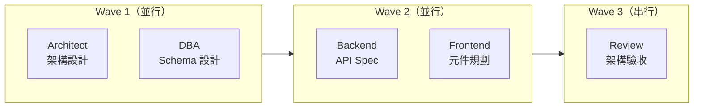

# Workflow Rules — [專案名稱]
<!-- 版本: v1.0 | 日期: YYYY-MM-DD | 來源: AI-First 五部曲 精華萃取 -->

> 這份文件是本專案 Agent 工作流程的行為規範。
> 每個 Agent 開始工作前，必須先讀這份文件。

---

## 一、文件 Header 標準格式（DOC-C §6.1）

每份 Agent 輸出的文件，**第一行必須是 Front-Matter YAML 區塊**：

```yaml
---
doc_id: [DocType].[F碼].[描述3~6字母]   # 例：SRS.F09.ANN
title: [文件標題]
version: v0.1.0
maturity: Draft   # Draft | Review | Approved | Baselined | Deprecated | Archived
owner: [Agent名稱]
module: F##
feature: [功能名稱]
phase: [Px-Py]
last_gate: G0
created: YYYY-MM-DD
updated: YYYY-MM-DD
upstream: [[上游文件doc_id或檔名]]
downstream: [[下游文件doc_id或檔名]]
---
```

**備選**（純 Markdown 環境不支援 Front-Matter 時）：
```
<!-- 版本: v0.1.0 | 日期: YYYY-MM-DD | 產出 Agent: [Agent名稱] | 狀態: Draft | doc_id: [DocType].[F碼].[縮寫] -->
```

**maturity 狀態流轉（單向）：**
```
Draft → Review → Approved → Baselined → Deprecated → Archived
```
- **Draft**：Agent 剛產出，未經確認
- **Review**：交給下一個 Agent 或凱子確認中
- **Approved**：凱子已 sign-off，可供後續 Agent 引用
- **Baselined**：Gate 正式通過，可作為後續基準線
- **Deprecated / Archived**：有新版本取代，舊版移到 `_archive/` 或 `09_Archive/`

---

## 二、標準交接摘要格式（Handoff Summary）

每個 Agent 完成任務後，**最後一個輸出區塊必須是**：

```markdown
---
## 🔁 交接摘要

| 項目 | 內容 |
|------|------|
| **我是** | [Agent 名稱，例：PM Agent] |
| **交給** | [下一個 Agent，例：Architect Agent] |
| **完成了** | [1-2句，做了什麼] |
| **關鍵決策** | [做了哪些決定、為什麼，列點] |
| **產出文件** | [路徑，例：02_Specifications/US_F01_v0.1.md] |
| **你需要知道** | [下一個 Agent 必讀的重點，列點] |
| **未解決問題** | [還不確定的事、需要你釐清的，或「無」] |
```

### 範例（PM → Architect）

```markdown
---
## 🔁 交接摘要

| 項目 | 內容 |
|------|------|
| **我是** | PM Agent |
| **交給** | Architect Agent |
| **完成了** | 完成 F03 工單管理功能的 User Story，共 12 條 AC |
| **關鍵決策** | 1. 工單狀態機共 6 種狀態（草稿→指派→處理中→待確認→結案→作廢）<br>2. 跨租戶工單查詢需隔離，PM 確認用 tenant_id 過濾 |
| **產出文件** | `02_Specifications/US_F03_工單管理_v0.1.md` |
| **你需要知道** | 1. 工單與客服人員是多對多關係（需設計中間表）<br>2. 工單狀態變更需寫入稽核日誌<br>3. 預計第一階段只做前 4 種狀態，後 2 種下一期 |
| **未解決問題** | 工單逾時通知的觸發條件尚未定義（待凱子確認） |
```

---

## 三、文件引用規則（SSOT）

**原則：每份資訊只在一個地方定義，其他地方用路徑引用。**

```
禁止：把 SRS 的需求描述複製貼到 API Spec 裡
正確：API Spec 寫「見 02_Specifications/US_F03_v1.0.md § 3.2 工單狀態機」
```

引用格式：
```
→ 見 [路徑] § [章節編號] [章節名稱]
例：→ 見 02_Specifications/US_F03_v1.0.md § 2.1 狀態定義
```

**跨文件結構化引用（DOC-C §7.2）**
```
[{DocType}.{F碼}.{章}]                      → 最新版（開發引用預設）
[{DocType}.{F碼}.{章}@v{M}.{m}.{p}]         → 版本鎖定（CIA/稽核引用必用）
[{DocType}.{F碼}@baseline]                   → 最近一次 Baselined 版本
```

範例：
```
→ 見 [SRS.F03.2] 狀態機定義
→ 見 [API.F09.2@v1.0.0] POST /api/v1/announcements（版本鎖定）
→ 見 [SA.F01@baseline] RBAC 權限模型（基線引用）
```

引用方向（只能往上，禁止迴圈）：
```
需求種子 (Seed)
  ↑
  User Story / SRS
    ↑
    系統架構 / API Spec / DB Schema
      ↑
      程式碼 / 前端元件
        ↑
        測試計畫
```

---

## 四、AI 修改代碼的四步法

**Backend / Frontend Agent 修改任何代碼或 Schema，必須依序執行。**
**核心原則：一次最多改 1～3 個檔案，每步驗證後才繼續（小步快跑）。**

### Step 1：Grounding（接地確認）

修改前必須確認對現有 codebase 的認知正確，**不可依賴記憶**：

1. 讀取所有要修改的檔案最新完整內容
2. 讀取直接依賴的本地模組（import / interface / base class）
3. 確認當前 Git 分支 + 最新 commit
4. 確認 Schema / 資料結構定義（如涉及資料操作）
5. 輸出 **Grounding Report**，等確認後才開始修改

**Grounding Report 格式：**
```markdown
## Grounding Report
Branch: [分支名]  Last Commit: [hash] "[message]"
已讀取：[檔案路徑列表]（共 N 個）
當前狀態摘要：[1-3 句，例：Service 有 8 個公開方法，Entity 有 12 個欄位]
```

### 修改範圍控制（SC 規則）

| 規則 | 說明 |
|------|------|
| **SC-01** | 單次修改最多跨 **2 個架構層級**（例：資料層 + 業務層）|
| **SC-02** | 跨 3 層以上必須拆分多步，每步驗證後才繼續 |
| **SC-03** | 每步修改完成後必須執行對應層的測試 |

架構層級：L1 資料層 → L2 業務層 → L3 介面層 → L4 前端資料層 → L5 前端 UI 層

### 修改前檢查清單（PRE Checklist）

| # | 檢查項 | 失敗處理 |
|----|------|--------|
| PRE-01 | Grounding Report 已產出並確認 | 停止修改 |
| PRE-02 | 修改範圍 ≤ 2 個架構層級 | 拆分為多步 |
| PRE-03 | 所有要修改的檔案已讀取最新版 | 重新讀取 |
| PRE-04 | 依賴的 interface / type 簽名已確認 | 讀取依賴檔 |
| PRE-05 | 同模組的既有 Pattern 已識別 | 讀取同模組範例 |

### Step 2：Plan（計畫，等確認）

輸出修改計畫，包含：
- 要改哪些函數 / 欄位 / 表結構
- 為什麼要改（引用哪個需求文件 doc_id）
- 會影響哪些其他檔案
- 預計步數（若超過 3 步，列出分步計畫）

**等用戶確認「Plan OK」才能繼續。**

### Step 3：Execute（執行）

- 依照確認的 Plan 實施修改，**一次只改 1～3 個檔案**
- 同步展示 Before / After Diff

### 修改後驗證清單（POST Checklist）

| # | 驗證項 | 失敗處理 |
|----|------|--------|
| POST-01 | Diff Review（AI 自我審查修改內容完整性）| 回退修改 |
| POST-02 | Import / 依賴驗證（可編譯 / 無缺失引用）| 修復 |
| POST-03 | 型別簽名驗證（編譯通過 / 無型別錯誤）| 修復 |
| POST-04 | 單元測試通過 | 修復測試 |

### Step 4：Verify（驗證）

- 確認 POST Checklist 全通過
- 確認沒有破壞現有功能
- 若有更多步驟，回到 Step 3 繼續

**任何步驟失敗，停下來報告，不繼續。**

### AI Modification Session Log

多步修改（> 2 步）時，維護一份 Session Log 追蹤進度：

```markdown
## AI Modification Session Log
Session ID: MOD-[YYYY-MMDD]-[序號]  觸發需求: [doc_id]
預計步數: [N]  Grounding: [PASS/FAIL]

| 步驟 | 層級 | 修改檔案 | 狀態 | 測試 | Commit |
|------|------|---------|------|------|--------|
| 1    | L1   | [檔案]  | ✅   | PASS | [hash] |
| 2    | L2   | [檔案]  | 🔄   | —    | —      |
```

---

## 五、多租戶安全強制規則

所有涉及業務資料查詢的功能，**必須在交接摘要中明確說明**：

```
✅ 已確認 tenant_id 隔離：[說明如何隔離]
或
⚠️ 此功能涉及跨租戶資料，需要 Architect 確認隔離方案
```

---

## 六、AI Token 上下文管理

### 檔案讀取策略

| 檔案類型 | 估算 Token | 讀取策略 |
|---------|-----------|---------|
| 🟢 輕量（YAML / Schema / Config / 短型別定義）| 50-500 | 全量讀取，成本可忽略 |
| 🟡 中等（業務邏輯 / 模組 / 元件）| 300-2000 | 依 Grounding Protocol 決定範圍 |
| 🔴 重量（SRS / SA / 大型元件 / 長文件）| 2000+ | 摘要優先，按需讀取相關章節 |

- **TB-01**：單次修改的上下文檔案總 Token ≤ 窗口容量的 60%，保留 40% 給產出
- **TB-02**：跨模組讀取時，非目標模組只讀摘要或 Snapshot，不讀原始碼

### 三級警戒系統

| 警戒 | 閾值 | 動作 |
|------|------|------|
| 🟡 ALERT-1 注意 | 消耗達 **60%** | 自動報告剩餘量 + 預估剩餘步數；無需暫停 |
| 🟠 ALERT-2 警告 | 消耗達 **75%** | **必須暫停**；報告已完成 / 剩餘步驟 / 建議繼續或拆分；等用戶決策 |
| 🔴 ALERT-3 緊急 | 消耗達 **90%** | 進入安全收尾模式：完成當前步驟 → 產出 Checkpoint → 禁止開始新步驟 |

**安全收尾模式（ALERT-3 後）：**
1. 完成當前執行步驟（不中途放棄已開始的修改）
2. 執行 POST-Validation 對已完成步驟
3. 產出 Checkpoint Report
4. `git commit -m "WIP: partial modification - [Session ID]"`
5. 通知用戶：「會話即將結束，已產出 Checkpoint 供下次復原。」

### Checkpoint 格式

每 3 個執行步驟自動產出，或 ALERT-2 / ALERT-3 觸發時產出：

```markdown
## Checkpoint [CP-N]
Session: MOD-[日期]-[序號]  觸發原因: [ALERT-2 / ALERT-3 / 自動 / 手動]
Token 狀態: 已消耗 ~[N]K，剩餘 [X]%

已完成步驟：
| 步驟 | 層級 | 修改檔案 | 狀態 | Git Commit |
|------|------|---------|------|-----------|
| 1    | L1   | [檔案]  | ✅   | [hash]    |

待完成步驟：[步驟清單 + 目標檔案]
已修改檔案：[完整清單]
恢復指引：讀取此 Checkpoint → 確認 Git 狀態 → 從步驟 [N+1] 繼續
```

儲存位置：`.ai-sessions/` 目錄（不納入 Git 版控）

### 上下文重置後的復原流程

新對話需繼續上次工作時：
1. 讀取 `.ai-sessions/` 中最新的 Checkpoint
2. 確認 Git 狀態與 Checkpoint 的 last commit hash 一致
3. 重新執行 Grounding（針對待完成步驟）
4. 從未完成的步驟繼續執行

---

## 七、三定點 Review Gate

Pipeline 執行時，在以下三個節點**強制插入 Review Agent**，其他 Agent 後面不加 Review。

```
Interviewer + PM 完成所有 User Story
        ↓
  🔍 Review Gate 1 — 需求完整性檢查
        ↓
Architect + DBA 完成架構與 Schema
        ↓
  🔍 Review Gate 2 — 技術可行性（依專案調整）
        ↓
Backend + Frontend + QA 完成
        ↓
  🔍 Review Gate 3 — 交付前總檢查
```

### 各 Gate 的 Review 焦點（不做全面審查，只看指定項目）

**Gate 1 — 需求完整性**
- [ ] **Seed 成熟度評分達標**：S 規模 ≥ 70 分 / M、L 規模 ≥ 80 分
- [ ] **無 🔴 阻塞項殘留**：Interviewer 交接摘要的「🔴 阻塞項」欄位為「無」
- [ ] **Seed Scope Map 已產出**：IR 文件存於 `06_Interview_Records/`，含規模標記（S/M/L/XL）
- [ ] 每條 User Story 都有可被測試的 AC
- [ ] 需求之間沒有自相矛盾
- [ ] 邊界情境有沒有被覆蓋
- [ ] 「未解決問題」欄位是否已清空或有明確 owner

**Gate 2 — 技術可行性 + 資料契約**（依專案調整檢查項）
- [ ] 架構設計有沒有明顯的單點故障
- [ ] 技術決策有沒有寫入 `memory/decisions.md`
- [ ] 若有 AI 功能：有沒有評估 token 成本與降級方案
- [ ] 資料欄位定義文件（Field Registry）已建立且欄位數與 Schema 一致（DC-01）
- [ ] ENUM / 常數定義有單一真相源（SSOT）（DC-02）
- [ ] DB Migration 腳本已驗證（語法正確 + 語意等價）（DC-07）

**Gate 3 — 交付前總檢查 + AI 修改治理**
- [ ] 所有文件狀態是「確認」，沒有殘留「草稿」
- [ ] 產出文件路徑與 TASKS.md 記錄一致
- [ ] 沒有 TODO / TBD 未處理
- [ ] 前端驗證規則與後端驗證規則語意等價（DC-03）
- [ ] Schema Drift Detection 通過（無漂移項目）（DC-04）
- [ ] API Response 欄位未超出 API Spec 定義範圍（DC-05）
- [ ] ENUM / 常數值在前端、後端、DB 三端一致（DC-06）
- [ ] API 版本 / Changelog 已更新（DC-08）
- [ ] 多步修改均有 AI Modification Session Log，且 POST Checklist 全通過
- [ ] Grounding Report 均已產出（PRE-01）
- [ ] 單次修改範圍均未超過 2 個架構層級（SC-01）
- [ ] 所有 Gate Review Note 均已在 24hr 內完成（CI-01）
- [ ] 各模組 L2 回顧已完成且 Action Items 有指定負責人（CI-03/CI-05）
- [ ] 各模組 `metrics.yaml` 已更新（CI-08）

### L1 Gate 回顧（每次 Gate 後必做）

每次 Gate 審查完畢後（無論結果），**審查者必須在 24 小時內填寫 Gate Review Note**，存於 `07_Retrospectives/L1_Gate_Reviews/`。

觸發方式：執行 Gate 審查後，直接輸出 Gate Review Note（見 Section 十）

### Review Agent 觸發方式

```
執行 Review Gate [1/2/3]
```

### 燈號定義

| 燈號 | 意義 | 行動 |
|------|------|------|
| 🟢 綠燈 | 全部通過 | 直接繼續下一階段 |
| 🟡 黃燈 | 有條件通過 | 繼續，但列出的問題**必須在下一個 Gate 前**解決 |
| 🔴 紅燈 | 未通過 | 停止，修正後重新執行此 Gate |

### Review Agent 輸出格式

```markdown
## 🔍 Review Gate [編號] 結果

| 檢查項 | 燈號 | 說明 |
|--------|------|------|
| [項目] | 🟢 / 🟡 / 🔴 | [說明] |

**總燈號**：🟢 綠燈 — 通過，繼續下一階段
         🟡 黃燈 — 繼續，但以下問題須在 Gate [N+1] 前解決：[列點]
         🔴 紅燈 — 停止，以下問題修正後重跑：[列點]
```

---
## 八、Agent 路由提醒

若用戶的需求不屬於目前 Agent 的職責範圍，**主動提示路由**：

```
⚠️ 這個問題屬於 [Architect/DBA/UX] Agent 的職責範圍。
建議：貼上 context-seeds/SEED_[角色].md 開新對話處理。
```

---

## 九、檔案命名規範（DOC-C v1.3）

### 統一檔名公式（DOC-C §2.1）

```
{序號}_{文件類型}_{F碼}_{描述名}_{版本}.{副檔名}

例：
  02_SRS_F03_Ticket_v1.0.0.md      ← User Story / SRS 正式版
  03_SA_F03_Ticket_v1.0.0.md       ← 系統架構
  05_API_F03_Ticket_v1.0.0.yaml    ← API Spec
  06_DB_F03_Ticket_v1.0.0.md       ← DB Schema
  07_Proto_F03_Ticket_v0.1.0.html  ← UX Prototype
  17_UAT_F03_Ticket_v1.0.0.md      ← UAT 測試計畫
```

規則（DOC-C §2.2）：
- **序號**：2 位零補（01~26），對齊文件類型表
- **文件類型**：PascalCase 英文縮寫（見下方縮寫表）
- **F碼**：`F00~F99`，兩位數字（F01、F02...）
- **描述名**：PascalCase 英文，≤3 單字，無空格中文特殊字元
- **版本**：`v{Major}.{Minor}.{Patch}` 三段式（草稿 v0.x.x / 確認 v1.0.0+）
- **副檔名**：`.md` 文件 / `.yaml` API Spec / `.html` Prototype

### 文件類型縮寫清單（DOC-C §2.3 對照）

| 序號 | 縮寫 | 全名 | 對應 Agent | 存放位置（DOC-C 標準） |
|------|------|------|-----------|----------------------|
| 01 | `Seed` | 需求種子 | Interviewer | `01_Requirements/F##_[模組]/` |
| 02 | `SRS` | 軟體需求規格 | PM | `01_Requirements/F##_[模組]/` |
| 03 | `SA` | 系統分析書 | Architect | `02_Design/F##_[模組]/` |
| 04 | `SD` | 系統設計文件 | Architect | `02_Design/F##_[模組]/` |
| 05 | `API` | API 規格書 | Backend | `03_Contract/F##_[模組]/` |
| 06 | `DB` | 資料庫設計 | DBA | `03_Contract/F##_[模組]/` |
| 07 | `Proto` | UI Prototype | UX | `04_UX/F##_[模組]/` |
| 08 | `DS` | Design System | UX | `04_UX/F00_DesignSystem/` |
| 09 | `UISpec` | UI 元件規格書 | UX | `04_UX/F##_[模組]/` |
| 14 | `Perf` | 效能測試報告 | QA | `06_QA/F##_[模組]/` |
| 15 | `Comply` | 合規掃描報告 | Security | `06_QA/F##_[模組]/` |
| 16 | `PenTest` | 滲透測試報告 | Security | `06_QA/F##_[模組]/` |
| 17 | `UAT` | UAT 測試計畫 | QA | `07_UAT/F##_[模組]/` |
| 18 | `Deploy` | 部署文件 | DevOps | `08_Operations/deploy/` |
| 23 | `GRN` | Gate 審查即時記錄 | Review | `00_Governance/Retro/Gate/` |
| 24 | `MRR` | 模組回顧報告 | — | `00_Governance/Retro/Module/` |
| 26 | `PIP` | 流程改善提案 | — | `00_Governance/PIP/` |

> **💡 專案適配**：各專案可使用自訂資料夾結構，適配對照見 `memory/last_task.md`。

### doc_id 系統（DOC-C §6.2，GAP-A）

**DOC-C 標準 doc_id 格式（通用）：**
```
{DocType}.{F碼}.{描述3~6字母大寫}

例：
  SRS.F09.ANN   ← Announcement SRS
  SA.F03.CUS360 ← Customer360 SA
  API.F01.AUTH  ← Auth API Spec
```

**精簡格式（交接摘要適用）：**
```
[F##]-[類型縮寫]-v[版本]

例：
  F03-US-v1.0   → 02_Specifications/F03_US_[功能名稱]_v1.0.md
  F03-API-v0.2  → 03_System_Design/F03_API_[功能名稱]_v0.2.md
```

**雙向轉換規則（DOC-C §6.2）：**

| 方向 | 規則 | 範例 |
|------|------|------|
| `doc_id → 檔名` | `{序號}_{DocType}_{F碼}_{FullDesc}_v{M}.{m}.{p}.md` | `SRS.F09.ANN` → `02_SRS_F09_Announcement_v1.0.0.md` |
| `檔名 → doc_id` | 取「DocType + F碼 + 描述前3~6字母大寫」| `02_SRS_F09_Announcement_v1.0.0.md` → `SRS.F09.ANN` |

**AI 解析規則（版本化引用語法）：**
```
[SRS.F09.ANN]           → 最新版（HEAD）
[SRS.F09.ANN@v1.0.0]   → 鎖定 Git Tag SRS.F09-v1.0.0
[SRS.F09.ANN@baseline]  → 最近一次 Baselined 版本
```

> **規定**：CIA（變更影響評估）文件中引用的上游文件**必須**使用版本鎖定語法 `@v{M}.{m}.{p}`，確保稽核時能準確追溯「當時決策依據」。

### 特殊檔案命名規則（DOC-C §7，GAP-D）

| 檔案類型 | 命名格式 | 範例 | 存放位置 |
|---------|---------|------|---------|
| **CIA 記錄** | `CIA_{日期}_{F碼}_{描述}.md` | `CIA_2026-02-23_F09_AddField.md` | `00_Governance/CIA_Log/` |
| **會議紀錄** | `MTG_{日期}_{主題}.md` | `MTG_2026-02-23_SprintPlanning.md` | `00_Governance/` 或對應模組 |
| **訪談紀錄** | `INT_{主題}_{日期}.md` | `INT_Announcement_2026-02-23.md` | `06_Interview_Records/` |
| **文件模板** | `TPL_{NN}_{文件類型}.md` | `TPL_02_SRS.md` | `10_Methodology/templates/` |
| **ADR** | `ADR_{NNN}_{主題}.md` | `ADR_001_TechStack.md` | `00_Governance/ADR/` 或 `memory/decisions.md` |
| **環境設定** | `.env.{環境}` | `.env.production` | `08_Operations/deploy/` |
| **CI/CD 配置** | Pipeline 定義 | `.github/workflows/*.yml` | `.github/workflows/` |

**Git 生態標準檔案（必要）：** `.gitignore` + `.env.example` + `README.md` 必須存在於專案根目錄（V17 驗證項）

### MASTER_INDEX.md 格式規範（DOC-C §6.3，GAP-C）

**標準表格格式：**
```markdown
# MASTER_INDEX — [專案名稱] 文件總覽

| 文件ID | 檔名 | 成熟度 | 版本 | Owner | 最後 Gate | 更新日 |
|--------|------|--------|------|-------|----------|--------|
| Seed.F09.ANN | 01_Seed_F09_Announcement_v1.0.0.md | Approved | v1.0.0 | PM | G1 | 2026-02-23 |
| SRS.F09.ANN  | 02_SRS_F09_Announcement_v1.0.0.md  | Baselined | v1.0.0 | PM | G2 | 2026-02-25 |
| SA.F09.ANN   | 03_SA_F09_Announcement_v1.0.0.md   | Review    | v1.0.0 | 架構師 | — | 2026-02-26 |
```

**維護規則（F-11）：**

| 規則 | 說明 |
|------|------|
| **觸發更新** | 每次新增文件 / 修改版本號 / 變更成熟度時，**同步更新** MASTER_INDEX |
| **Owner** | PM（治理層文件責任人，對齊 RACI） |
| **CI 驗證** | Pipeline ① Lint 階段加入 `master-index-check`：比對實際檔案與 INDEX 記錄，不一致則 **Warning** |
| **頻率** | 至少每 Sprint 末確認一次完整性 |
| **Git 版** | 進入 Git 後「版本」欄改為「最新 Tag」欄（格式：`{DocType}.{F碼}-v{M}.{m}.{p}`） |

### 歸檔規則（DOC-C §8 含逾期規則，GAP-F）

**成熟度 → 位置 → 逾期規則（DOC-C §8.2）：**

| 成熟度 | 檔案位置 | front-matter 值 | 逾期規則 |
|--------|---------|----------------|---------|
| **Draft** | 工作資料夾（正常位置）| `Draft` | > 14天 → 提醒 Owner；> 30天 → PM 決定保留/歸檔 |
| **Review** | 工作資料夾（正常位置）| `Review` | > 7天 → 自動退回 Draft |
| **Approved** | 工作資料夾（正常位置）| `Approved` | — |
| **Baselined** | 工作資料夾（正常位置）| `Baselined` | — |
| **Deprecated** | 模組內 `_archive/` | `Deprecated` | > 90天 → 自動移至全域 `09_Archive/` |
| **Archived** | `09_Archive/{年}-{季}/` | `Archived` | 永久保存，唯讀 |

**觸發歸檔動作：**

| 成熟度轉換 | 歸檔動作 | 目標位置 |
|-----------|---------|---------|
| 任何版本被新版取代 | 舊版移入模組 `_archive/` | `[階段]/F##_[模組]/_archive/` |
| Deprecated → Archived | 移至全域歸檔 | `09_Archive/{年}-{季}/` |
| Baselined 被新 Major 取代 | 直接移至全域歸檔 | `09_Archive/{年}-{季}/` |

**禁止事項：**
- ❌ 直接刪除任何通過 Gate 的文件（Approved 以上）→ 只能歸檔
- ❌ 在 Active 資料夾同時存放 > 2 個版本（超過自動移入 `_archive/`）
- ❌ 在檔名嵌入成熟度（如 `_draft`、`_final`）→ 成熟度只放 front-matter

### Git 化後的版本管理（進入 Git repo 後適用）

當文件納入 Git 版控後，版本號改由 Git Tag 管理，不再寫在檔名中：

| 項目 | 本機版（概念期）| Git 版 |
|------|--------------|--------|
| 檔名 | `02_SRS_F09_Announcement_v1.0.0.md` | `02_SRS_F09_Announcement.md`（移除版本後綴）|
| 版本追蹤 | 檔名後綴 `_v1.0.0` | Git Tag：`SRS.F09-v1.0.0` |
| 成熟度 | front-matter `maturity:` | front-matter `maturity:`（不變）|

Git Tag 格式：
```
{DocType}.{F碼}-v{Major}.{Minor}.{Patch}
例：SRS.F09-v1.0.0、API.F03-v2.0.0
```

遷移步驟（概念期 → Git 正式版本控時執行一次）：
1. 批次重新命名：用 `git mv` 移除所有檔名的 `_v{x.y.z}` 後綴
2. 為每份文件建立 Git Tag（格式如上）
3. 更新 MASTER_INDEX：「版本」欄改為「最新 Tag」欄
4. CIA 文件中的引用改為版本鎖定格式：`@v{M}.{m}.{p}`

## 十、回顧機制（Retrospective Framework）

**核心理念**：回顧不只發生在專案結束時。三層回顧設計確保不同粒度的改善都有機制承接。

### 三層回顧架構

| 層級 | 觸發時機 | 時長 | 產出 | 儲存位置 |
|------|---------|------|------|---------|
| **L1 Gate 回顧** | 每次 Gate 審查後（無論通過或退回）| 15 分鐘 | Gate Review Note | `07_Retrospectives/L1_Gate_Reviews/` |
| **L2 模組回顧** | 單一 F碼 模組交付後 | 45 分鐘 | Module Retro Report | `07_Retrospectives/L2_Module_Retros/` |
| **L3 專案回顧** | 全專案 Release 後 | 2 小時 | Project Retro Report + PIP | `07_Retrospectives/L3_Project_Retros/` |

### L1 — Gate Review Note 格式

每次 Gate 審查後 **24 小時內**必須完成（GR-01），FAIL 時記錄至少 2-Why 根因（GR-02）：

```markdown
## Gate Review Note
Gate: G[N]  模組: F[NN]  日期: YYYY-MM-DD  審查者: [角色]
結果: ✅ PASS / 🟡 CONDITIONAL PASS / ❌ FAIL

### 量化
- 首次通過: YES / NO  退回次數: [N]  審查耗時: [分鐘]
- AI 信心度分布: 🟢[N] / 🟡[N] / 🔴[N]

### 品質觀察
- 問題類型: [ ] 欄位遺漏 [ ] 邏輯矛盾 [ ] SSOT 違反 [ ] 格式不符 [ ] 其他: ___
- AI 幻覺: [ ] 無 [ ] 有（類型: H1/H2/H3/H4/H5/H6/H7/H8 → 見 Section 十二）
  若有，必填以下幻覺追溯欄位（HT 指標計算依據，不可省略）：
  - `hallucination_root_cause`: true | false （此問題是否源自 AI 幻覺）
  - `hallucination_type`: H1 | H2 | H3 | H4 | H5 | H6 | H7 | H8 | N/A
  - `hallucination_origin_phase`: P? （幻覺產生的 Phase，例：P4 SA 設計階段）
  - `hallucination_discovery_phase`: P? （幻覺被發現的 Phase，例：P7 Code Review）
  - `cascade_files_affected`: [受連鎖影響的文件清單] （HT-03 CR 連鎖乘數計算依據）
  - 具體位置: [檔案 §章節]  描述: [簡述幻覺內容]

### 改善建議
- 流程: ___  模板: ___  AI Prompt: ___
```

### L2 — Module Retro Report 格式

模組交付後 **5 個工作天內**完成（MR-01），全團隊參與，每人至少貢獻 1 項（MR-03）：

```markdown
## Module Retrospective Report
模組: F[NN]  期間: YYYY-MM-DD ~ YYYY-MM-DD  參與者: [角色列表]

### 量化儀表板
| 指標 | 數值 | 基準線 |
|------|------|--------|
| Gate 首次通過率   | [%] | ≥75%  |
| AI 產出採用率     | [%] | ≥70%  |
| 🔴 信心度佔比     | [%] | <10%  |
| AI 幻覺次數       | [N] | ≤3    |
| 幻覺逃逸率 HT-01  | [%] | <5%   |

### 4L 回顧
| 面向 | 內容 |
|------|------|
| **Liked**（做得好）     | [共識優點]         |
| **Learned**（學到什麼） | [新發現的最佳實踐] |
| **Lacked**（缺少什麼）  | [資源/工具不足]    |
| **Longed for**（期望）  | [希望改善的方向]   |

### MR-07~10 Seed 回顧（v1.4 新增，每個 L2 必查）
| 規則 | 檢查項目 | 結果 |
|------|---------|------|
| MR-07 | Session Handoff 檔案已歸檔至 `_session_history/` | ✅/❌ |
| MR-08 | Seed 階段是否有「早該問但沒問」的問題？→ 觸發 PIP 回饋至訪談模板 | ✅ 無 / ⚠️ 有：[描述] |
| MR-09 | Seed Journey Mapping vs UAT 實測偏差 → 回饋至 UX Track | ✅ 吻合 / ⚠️ 偏差：[描述] |
| MR-10 | Seed Maturity Score 校準：各維度權重是否合理？ | ✅ 合理 / ⚠️ [哪維度偏低]→ PIP |

### Action Items
| # | 行動 | 負責人 | 截止日 | 狀態 |
|---|------|--------|--------|------|
| 1 | [具體行動] | [角色] | [日期] | ⬜ Open |
```

### L3 — Project Retro Report 格式

Release 後 **10 個工作天內**完成（PR-01），必須進行 5-Why 根因分析（PR-04），至少產出 1 件 PIP（PR-05）：

```markdown
## Project Retrospective Report
專案名: [名稱]  期間: YYYY-MM-DD ~ YYYY-MM-DD
模組數: [N]  總 Release 版本: v[X.Y.Z]

### 全專案健康度
| 維度 | 指標 | 數值 | 目標 | 達成 |
|------|------|------|------|------|
| 品質 | Gate 整體首次通過率 | [%]  | ≥75% | ✅/❌ |
| 品質 | 生產環境缺陷數      | [N]  | 0    | ✅/❌ |
| 效率 | 實際工期 vs 預估    | [±%] | ±10% | ✅/❌ |
| AI   | AI 產出採用率       | [%]  | ≥70% | ✅/❌ |
| 合規 | 合規掃描 P1 問題    | [N]  | 0    | ✅/❌ |

### Top 5 問題根因（5-Why）
| # | 問題 | 影響範圍 | 根因 | 改善類別 |
|---|------|---------|------|---------|
| 1 | [問題] | [範圍] | [根因] | 流程/模板/工具 |

### 下次啟動行前須知（Starter Kit Updates）
| # | 更新項目 | 目標文件 |
|---|---------|---------|
| 1 | [具體更新] | [文件 §章節] |
```

### 追蹤指標（精選）

每個模組完成後，更新 `07_Retrospectives/metrics/F[NN]_metrics.yaml`：

| 代碼 | 類別 | 指標名稱 | 基準線 |
|------|------|---------|--------|
| Q-01 | 品質 | Gate 首次通過率 | ≥75% |
| Q-03 | 品質 | UT 覆蓋率 | ≥80% |
| Q-04 | 品質 | Schema Drift 次數 | 0 |
| E-01 | 效率 | Phase 耗時偏差率 | ±15% |
| A-01 | AI | AI 產出首次採用率 | ≥70% |
| A-03 | AI | AI 幻覺發生頻率 | 每模組 ≤3 次 |
| A-05 | AI | Token 消耗預估準確率 | ≥85% |
| C-01 | 合規 | 合規掃描 P1 問題數 | 0 |
| **HT-01** | 幻覺 | 幻覺逃逸率（AI 幻覺導致的 CR 數 ÷ AI 產出文件總數）| < 5% |
| **HT-02** | 幻覺 | 幻覺類型分佈（無單一 H 類型 > 30%）| 0 類型超標 |
| **HT-03** | 幻覺 | CR 連鎖乘數（CR 修改文件數 ÷ 幻覺源頭文件數）| < 2.0x |
| **HT-04** | 幻覺 | 發現延遲（CR 發現 Phase − 幻覺產生 Phase）| ≤ 2 |
| **HT-05** | 幻覺 | Seed Summary 有效性（使用後 H1+H2 逃逸率降幅）| 降幅 ≥ 30% |
| **HT-06** | 幻覺 | RT 分級準確度（高風險 CR 與 Tier-1 模組重合度）| ≥ 80% |
| **UX-01** | UX | 設計還原度（前端實作 ↔ Prototype 視覺差異分數）| ≥ 95% |
| **UX-02** | UX | a11y 合規分數（Lighthouse Accessibility Score）| ≥ 90 |
| **UX-03** | UX | Design Token 覆蓋率（Token 變數樣式 ÷ 總樣式宣告）| ≥ 90% |
| **UX-04** | UX | 元件 Storybook 覆蓋率（共用 100% / 業務 ≥ 80%）| 依類型 |
| **UX-05** | UX | Empty / Error / Loading 三態完整率 | 100% |
| **HA-01** | 人機 | 人工審核介入率（需人工修正的 AI 產出比例）| ≤ 30% |
| **HA-04** | 人機 | AI 能力邊界越界次數（執行「必須人工」任務次數）| 0 |

> **HT 指標說明**：HT-01~04 每次 CR 後更新；HT-05/06 季度比較。觸發條件：HT-01 > 5% 連續 2 個月 → 觸發 PIP 檢討 Reviewer Prompt；單一 H 類型 > 30% → 補充 KB-AH 條目 + Few-shot。

### 流程改善提案（PIP）

發現流程問題時，提交 PIP（儲存至 `07_Retrospectives/PIPs/PIP-[YYYY]-[NNN].md`）：

```markdown
## Process Improvement Proposal
PIP 編號: PIP-[YYYY]-[NNN]  提案人: [角色]  日期: YYYY-MM-DD
來源: L1 Gate回顧 / L2 模組回顧 / L3 專案回顧 / 日常觀察
優先級: P1 緊急 / P2 重要 / P3 改善 / P4 建議

### 問題描述
- 現狀: [目前的流程/規範]
- 問題: [具體問題]
- 影響: [量化影響，引用指標代碼]
- 根因: [5-Why 分析]

### 改善方案
- 目標: [改善後的期望狀態]
- 方案: [具體變更內容]
- 預期效益: [量化目標]

### 審批
- 架構師: ⬜ 同意 / ⬜ 有條件 / ⬜ 不同意
- PM: ⬜ 同意 / ⬜ 有條件 / ⬜ 不同意
```

PIP 規則：
- **PIP-01**：任何角色均可提出，無需層級授權
- **PIP-02**：L3 專案回顧必須至少產出 1 件 PIP
- **PIP-05**：P1/P2 級 PIP 必須在 10 個工作天內完成評估
- **PIP-08**：實施後追蹤相關指標至少 1 個模組週期

---

---

## 十一、AI 輸出信心度標記（全局規則）

**所有 Agent 的文件輸出，凡涉及判斷、假設、推論的陳述，必須標記信心度。**
這讓後續的 Agent 和人工審查者一眼看出哪些結論是「確定的」、哪些是「推測的」。

### 三色標記定義

| 標記 | 名稱 | 使用條件 | 範例 |
|------|------|---------|------|
| 🟢 | **清晰** | 有明確依據：來自訪談記錄、已確認的需求、或可驗證的事實 | `🟢 用戶需要在 30 秒內看到結果（訪談 R1-05 確認）` |
| 🟡 | **模糊** | 方向合理但細節不足，或推論自其他需求、業界慣例 | `🟡 預估 1000 筆/日（依同類系統類推，未實測）` |
| 🔴 | **阻塞** | 未回答、互相矛盾、「之後再說」、或假設有高度風險 | `🔴 跨租戶查詢的隔離方案未確認（必須解決後才能設計 DB）` |

### 強制標記時機

以下情境**必須**標記，其他地方可選：

| 情境 | 說明 |
|------|------|
| 非功能需求數值（效能、容量）| 來源不明的數字容易被 AI 捏造，必須標明依據 |
| 跨模組介面假設 | 依賴其他模組的行為，但該模組尚未設計 |
| 權限或角色設計 | 往往訪談時未深問，容易有漏洞 |
| 合規或法規相關 | 高風險，錯誤成本大，必須有確認來源 |
| 未來擴展性假設 | AI 常自行腦補「以後要支援 X」，需要標明是否確認 |

### 在交接摘要中的呈現

升級後的交接摘要格式（對應 Section 二），新增信心度行：

```markdown
| **信心度分布** | 🟢 [N 項] / 🟡 [N 項，列關鍵項] / 🔴 [N 項，阻塞項必須在此列明] |
```

### 🔴 阻塞項處理原則

- 🔴 阻塞項 = 當前 Agent **不得**繼續推進，必須回頭確認
- 若情況不允許立刻確認，🔴 項目須寫入交接摘要，由接收方 Agent 的第一步處理
- **Gate 1 硬性規則**：Interviewer 交出的 IR 文件中，🔴 阻塞項必須為 0 才能進 PM Agent

---

---

## 十二、AI 幻覺分類系統（H1-H8 全局規則）

**所有 Agent 的輸出在 Review 時，必須識別幻覺類型。L1 Gate Review Note 和 SEED_Review 都應標記。**

### 八種幻覺類型定義

| 代碼 | 名稱 | 定義 | 典型範例 | 高風險場景 |
|------|------|------|---------|-----------|
| **H1** | NFR 值捏造 | AI 產出的效能/容量數值無 Seed/訪談依據 | 「回應時間 < 200ms」但訪談未提及 | SRS §8（NFR章節）、SA 效能設計 |
| **H2** | 業務規則腦補 | AI 自行推論業務規則，非客戶確認需求 | 「額度超 50 萬需主管覆核」但 Seed 無此要求 | SRS §3（業務邏輯）、GWT 驗收條件 |
| **H3** | 架構假設 | AI 假設技術選型，但 Seed/ADR 未指定 | 假設用 Redis Cluster 但無架構決策依據 | SA 技術選型、SD 系統設計 |
| **H4** | 邊界行為假設 | AI 假設系統邊界行為但無規格來源 | 假設 CTI 斷線 5 秒自動重連，但 NFR 未定義 | SRS §9（邊界NFR）、API 錯誤碼定義 |
| **H5** | 合規要求推論 | AI 推論法規要求但未查證條文 | 「金管會要求保留 7 年」但未附法規條文佐證 | SRS §7（合規章節）、SEC 審查報告 |
| **H6** | API 欄位擴充 | AI 自行在 API 中增加 Seed 不存在的欄位 | 多出 `lastLoginIP` 但 SRS 無此需求 | API Spec、DB Schema、Field Registry |
| **H7** | 錯誤處理腦補 | catch 邏輯基於 AI 假設的異常場景 | `catch TimeoutException` 但 NFR 未定義逾時條件 | API 錯誤碼表、Backend Service 實作 |
| **H8** | UI 流程假設 | AI 自行補充 UI 互動流程，Seed 未定義 | 自行加入二次確認彈窗但無 UX 需求 | Proto 原型、UISpec 元件規格 |

### 幻覺追蹤規則

- **HT-01 幻覺逃逸率目標**：AI 幻覺導致的 CR 數 ÷ AI 產出文件總數 < 5%
- **HT-02 類型分佈**：無單一幻覺類型佔比 > 30%（否則觸發 Prompt 改善 PIP）
- **偵測後必填**：`hallucination_root_cause: true/false` + `hallucination_type: H?`
- **HT-01 > 5% 連續 2 個月** → 觸發 PIP，檢討 Review Prompt 與 RT 分級

### L1 Gate Review Note 幻覺欄位（標準格式）

```
AI 幻覺偵測：[ ] 無  [ ] 有
若有，填入：[ ] H1 NFR捏造  [ ] H2 業務腦補  [ ] H3 架構假設  [ ] H4 邊界假設
           [ ] H5 合規推論  [ ] H6 欄位擴充  [ ] H7 錯誤腦補  [ ] H8 UI假設
具體位置：[文件 §章節]  描述：[簡述]
```

---

## 十三、嵌入式治理標記（GA-xx — DOC-C §9 完整版）

**核心概念**：在關鍵文件的指定位置插入治理標籤，讓 AI 掃描與人工審查能快速定位合規點。
**SSOT 宣告**：GA-xx 命名規則以 DOC-C §9 為準；業務語意以 DOC-A §12B 為準。

### GA-xx 10 大類型（DOC-C §9.1）

| 類型代碼 | 名稱 | 用途 | 放置位置 | 主要簽核角色 | 對應 Agent |
|---------|------|------|---------|------------|-----------|
| `GA-CR` | 合規要件 | 金管會/ISO/個資法要求 | 文件頂部 | 資安專家 | Security |
| `GA-SIG` | 簽名簽核 | 最終批准確認 | 文件底部 footer | PM / CTO | 所有 Agent |
| `GA-ARCH` | 架構決策 | 系統設計決定（ADR） | SA/SD 文件 | 架構師 | Architect |
| `GA-SCHEMA` | 資料契約 | API/DB Schema 版本鎖定 | 契約層文件 | DBA | DBA |
| `GA-DS` | UI 設計令牌 | Design System 元件版本鎖定 | DS/UISpec 文件 | UX | UX |
| `GA-API` | API 契約 | API Endpoint 定義確認 | API Spec | 後端 PM | Backend |
| `GA-SEC` | 安全審查 | 安全滲透測試通過 | PenTest 報告 | 資安專家 | Security |
| `GA-PERF` | 效能基準 | 性能目標達成確認 | Perf 報告 | 後端/SRE | DevOps/Backend |
| `GA-COMP` | 合規評分 | 文件合規評分 ≥ 門檻 | 任意治理文件 | PM | Review |
| `GA-VER` | 版本控制 | 版本號鎖定 | CHANGELOG | 發版經理 | DevOps |
| `GA-XMOD` | 跨模組契約驗證 | SA→SD→API→DB→Test→GRN 六層介面一致性確認 | SA + API Spec + DB + 測試報告 | 架構師 + Backend | Architect + Backend + Review |

### GA-XMOD 跨模組契約驗證鏈（六層防禦）

跨模組介面是 AI 幻覺（尤其 H3、H6）的高發地帶。GA-XMOD 建立六層依序確認機制：

```
Layer 1 SA  → 模組邊界與服務介面定義
Layer 2 SD  → 技術實作細節（資料流、狀態機）
Layer 3 API → Endpoint 欄位與型別一致性（對齊 Field Registry）
Layer 4 DB  → Schema 欄位與 SA/API 對齊（無 Drift）
Layer 5 Test → 契約測試通過（Consumer 未受 Breaking Change 影響）
Layer 6 GRN → Gate Review 交叉驗證（Review Agent 最終確認）
```

**GA-XMOD 標記格式：**
```markdown
[GA-XMOD-{NNN}] {描述本文件覆蓋的驗證層級}

# 範例：
[GA-XMOD-001] SA 層：模組邊界已對齊 Scope Map capability_tree（Layer 1 確認）
[GA-XMOD-002] API 層：所有欄位已在 Field Registry 登錄，無未定義欄位（Layer 3 確認）
[GA-XMOD-003] GRN 層：SA→SD→API→DB 四層一致性已交叉驗證（Layer 6 確認）
```

**觸發條件：** 跨模組介面修改（新增 API 欄位、Schema 變更、模組邊界調整）時，Architect、Backend、Review 三個 Agent 必須各自在輸出文件中嵌入對應 Layer 的 GA-XMOD 標記。

### GA 標記嵌入格式（DOC-C §9.2）

```markdown
[GA-{TYPE}-{NNN}] {描述}

# 行內嵌入格式（文件條文旁）：
[GA-CR-001] 本章定義個資欄位（個資法第 5 條）
[GA-ARCH-001] 選擇 JWT 無狀態驗證（見 ADR-001）
[GA-SCHEMA-001] customer_phone VARCHAR(20) — 已定義於 Field Registry v1.0
[GA-API-001] POST /api/v1/announcements — 已凍結 v1.0.0

# 頁尾簽核格式（每份交付文件底部）：
<!-- GA-SIG: [Agent] 簽核 | 日期: YYYY-MM-DD | 版本: v0.1.0 | 信心度: 🟢N/🟡N/🔴N -->
```

> NNN 為 001~999 序號，同一 TYPE 內不重複且遞增。

### GA-COMP 合規評分（Gate 必算，來源：DOC-D §25）

**Composite Score = Σ(Category Score × Weight)**

| 評分類別 | 權重 | 說明 |
|---------|------|------|
| GA Coverage（GA 標記密度） | 25% | (已嵌入 GA 標記數 / 必要 GA 標記數) × 100 |
| Sign-off Completeness（簽核完整性） | 25% | (已完成簽核項 / 必要簽核項) × 100 |
| Gate Pass Rate（首次通過率） | 20% | (首次通過 Gate 數 / 嘗試 Gate 總數) × 100 |
| Hallucination Density（幻覺密度，越低越好） | 15% | max(0, 100 − (幻覺數 / 總 assertion × 500)) |
| PII/Security Compliance（合規欄位） | 15% | (合規欄位數 / 總 pii_ 欄位數) × 100 |

**分級標準：**

| 等級 | 分數範圍 | 意義 | Gate 決策 |
|------|---------|------|---------|
| **A（Exemplary）** | ≥ 90 | 優秀，完全符合 | 直接通過，表揚團隊 |
| **B（Acceptable）** | 75–89 | 良好，有輕微缺陷 | PASS（含輕微改善建議） |
| **C（Marginal）** | 60–74 | 邊緣，有明顯缺漏 | CONDITIONAL（5天內完成 PIP） |
| **D（Deficient）** | 40–59 | 不足，需大幅修正 | BLOCK（強制修正衝刺） |
| **F（Fail）** | < 40 | 失敗，需重新稽核 | FAIL（從 P4 重新稽核，上報 CTO） |

**Gate 最低門檻：**

| Gate | 最低要求 | 未達標處理 |
|------|---------|---------|
| Gate 2（SRS 審查） | ≥ B（75%） | HOLD — 不進行 SA 工作，先修正 SRS |
| Gate 3（SA 審查） | ≥ B（75%） | HOLD — 不進行設計工作 |
| Gate 4（Code Review） | ≥ B（75%） | REWORK — 返工，重新審查 |
| Gate 5（合規掃描） | ≥ A（90%） | FAILED — 合規未達標，需 remediation sprint |

**計算範例：** GA Coverage 80×0.25=20.0 + Sign-off 100×0.25=25.0 + Gate Pass 80×0.20=16.0 + Hallucination 70×0.15=10.5 + PII 100×0.15=15.0 = **86.5 → Grade B**

### AI Sign-off 結構化記錄（GAP-D：AI Role Sign-off）

關鍵交付文件（SA、API Spec、DB Schema、Security Report）完成後，需產出：

**① 頁尾 GA-SIG 行（每份文件必備）**：
```html
<!-- GA-SIG: [Agent] 簽核 | 日期: YYYY-MM-DD | 版本: v0.1.0 | 信心度: 🟢N/🟡N/🔴N -->
```

**② ReviewFindings（多步修改或 Gate 2/3 後選填）**：
```markdown
## AI Review Findings — [功能名稱]（F##）
Agent: [Agent名稱] | 日期: YYYY-MM-DD | 文件: [doc_id]

| # | 發現類型 | 位置 | 描述 | 處理狀態 |
|---|---------|------|------|---------|
| 1 | H1 NFR捏造 | §3 效能需求 | 「回應 < 200ms」無訪談依據 | 🔴 已標記 |
| 2 | GA-COMP | §5 安全 | JWT 驗證條款符合規定 | 🟢 通過 |
```

Gate 2/3 Review 前，確認所有關鍵文件均有 `GA-SIG` 行。

### GA Phase → GA 映射表（DOC-C §9.4，GAP-E）

每個 Phase 有「主要 GA」（必填）和「驗證性 GA」（確認上游仍有效）：

| Phase | 主要 GA（Primary） | 驗證性 GA（Secondary） |
|-------|-------------------|----------------------|
| P2（SRS）| GA-REQ | — |
| P4（SA）| GA-ARCH | GA-REQ（需求驗證）|
| P6A（SD）| GA-API, GA-DB | GA-ARCH（架構驗證）|
| P6B（UI）| GA-DS | GA-ARCH（架構驗證）|
| P7（Code）| GA-CODE → GA-SIG | GA-API, GA-DB |
| P8（Compliance）| GA-SEC, GA-CR, GA-COMP | 所有前序 GA |
| P9（UAT）| GA-TEST | 所有前序 GA |
| P10（Deploy）| GA-SIG（最終簽核）| 所有前序 GA（最終確認）|

### GA 密度門檻（per 1000 words，DOC-C §9.4）

| 文件類型 | 最低 GA 數/千字 | 目標 | 最少 GA 總數 |
|---------|--------------|------|------------|
| Seed / SRS | 3 | 5 | ≥ 3 個 GA |
| SA | 4 | 6 | ≥ 5 個 GA |
| SD（API Spec）| 5 | 8 | ≥ 10 個 GA |
| SD（DB Design）| 4 | 6 | ≥ 5 個 GA |
| 合規/PenTest | 6 | 10 | ≥ 5 個 GA |
| UX（DS/UISpec）| 3 | 5 | ≥ 5 個 GA |

> 密度不足時，Gate Review 應在 ReviewFindings 中標記「GA Coverage 不足」並計入 GA-COMP 的「GA Coverage（25%）」分類扣分。

### GA-xx ↔ Sign-off 追溯矩陣（DOC-C §10.3）

| GA 類型 | 對應 Sign-off 檔模式 | 驗證 Gate |
|--------|---------------------|---------|
| `GA-REQ` | `SignoffLog_SRS_{F碼}_v{X.Y}.yaml` | G2 |
| `GA-ARCH` | `SignoffLog_SA_{F碼}_v{X.Y}.yaml` | G3 |
| `GA-API` | `SignoffLog_SD-API_{F碼}_v{X.Y}.yaml` | G4 |
| `GA-DB` | `SignoffLog_SD-DB_{F碼}_v{X.Y}.yaml` | G4 |
| `GA-SEC` | `SignoffLog_SEC_{F碼}_v{X.Y}.yaml` | G8 |
| `GA-DS` | `SignoffLog_UI_{F碼}_v{X.Y}.yaml` | G5 |
| `GA-TEST` | `SignoffLog_TEST_{F碼}_v{X.Y}.yaml` | G7 |
| `GA-COMP` | `GA-COMP_Score_{F碼}_v{X.Y}.yaml` | G8 |
| `GA-SIG` | `SignoffLog_META_{F碼}_v{X.Y}.yaml` | 每個 Gate |

> **可追溯性規則**：每個 GA 標記嵌入文件時，必須在對應 Sign-off Log 中記錄：`ga_marker_id`、`embedded_in`（文件路徑）、`embedded_by`（AI/Human）、`embedded_at`（ISO 8601）、`verified_at_gate`（G{N}）。

---

## 十四、知識庫生命週期規則（KB Lifecycle）

`memory/` 是本專案的知識庫（KB），每個 session 結束時需維護：

| 規則 | 說明 |
|------|------|
| **KB-01** | `memory/last_task.md` 每次 session 結束前更新（完成事項 + 待續） |
| **KB-02** | `memory/decisions.md` 每次 ADR 確認後當日寫入，不得事後補寫 |
| **KB-03** | 已廢棄的決策在 decisions.md 標記 `[已廢棄]`，不直接刪除 |
| **KB-04** | L2 模組回顧後，將本次學到的「已知陷阱」追加至 `memory/glossary.md` 的對應章節 |
| **KB-05** | 每個 F 碼完成後，在 `memory/` 對應模組檔案補充「本模組最終決策摘要」 |

### KB 七類分類（A_Law v3.0 Rebuild Template §7）

`memory/knowledge_base/` 子目錄依以下七類組織：

| 類別代碼 | 全名 | 用途 | 存放路徑 |
|---------|------|------|---------|
| **KB-BP** | Best Practices | 已驗證的最佳實踐與成功模式 | `memory/knowledge_base/KB-BP_*.md` |
| **KB-PT** | Patterns | 架構/設計/代碼模式（可複用） | `memory/knowledge_base/KB-PT_*.md` |
| **KB-TM** | Templates | 文件模板與輸出格式（可直接套用） | `memory/knowledge_base/KB-TM_*.md` |
| **KB-TL** | Tools | 工具使用指南（CLI / SDK / 整合） | `memory/knowledge_base/KB-TL_*.md` |
| **KB-AI** | AI Usage | AI Prompt 技巧與輸出品質控制 | `memory/knowledge_base/KB-AI_*.md` |
| **KB-BS** | Business | 業務知識（領域術語、法規、客戶決策） | `memory/knowledge_base/KB-BS_*.md` |
| **KB-AH** | AI Hallucination | AI 幻覺已知模式與預防措施（初始內容見 `KB-AH_hallucination_patterns.md`） | `memory/knowledge_base/KB-AH_*.md` |

> **KB-AH 特別說明**：每次 L2 模組回顧後，將已發生的幻覺案例追加至 `memory/knowledge_base/KB-AH_hallucination_patterns.md`，是幻覺逃逸率（HT-01）持續改善的核心機制。

### KB 條目生命週期管理（KB-06 自動觸發規則）

> 來源：Continuous_Improvement_and_Retrospective_v1.4 §8.2

KB 條目四種狀態：

| 狀態 | YAML 標記 | 說明 |
|------|----------|------|
| 有效 | `status: active` | 當前有效，Agent 可直接引用 |
| 複審中 | `status: under_review` | 觸發複審條件，暫緩新引用，等待驗證結果 |
| 已廢棄 | `status: deprecated` | 仍可參考，但不建議直接套用；Agent 讀取時加 ⚠️ 警示 |
| 已歸檔 | `status: archived` | 純歷史追溯用；Agent 讀取時**自動跳過** |

自動觸發規則：

| 規則 | 觸發條件 | 動作 |
|------|---------|------|
| **KB-06a** | Active 條目超過 **6 個月**未被引用（`roi_tracking.last_cited` 為空或超期） | 自動標記 `under_review`，在 `TASKS.md` 新增複審 Task |
| **KB-06b** | 相關技術棧版本升級（例：Spring Boot 升版、Claude 模型升版） | 相關 KB 條目自動標記 `under_review`；觸發者在 `memory/decisions.md` 登錄 ADR |
| **KB-06c** | Deprecated 條目超過 **12 個月**仍未轉回 Active 或更新 | 自動建議轉為 `archived`，須由架構師確認後執行 |
| **KB-06d** | Agent 進場讀取 KB 時：Archived 條目自動跳過；Deprecated 條目顯示前加 ⚠️ 「此條目已廢棄，建議確認後使用」 | — |

---

## 十五、AI Agent 方法論版本同步規則（VE-01~04）

> 來源：Continuous_Improvement_and_Retrospective_v1.4 §7（Methodology Versioning）

| 規則 | 說明 |
|------|------|
| **VE-01** | 每次方法論更新（workflow_rules.md / Seed / KB 重大改版）後，`workflow_rules.md` footer 版本號必須同步遞增，格式：`v{Major}.{Minor}`（Breaking change +1.0；小幅補強 +0.1） |
| **VE-02** | 每次方法論版本變更，更新項目摘要必須寫入 `memory/last_task.md` 的「本次方法論更新」欄位，格式：`[vX.Y] YYYY-MM-DD — [更新摘要]` |
| **VE-03** | AI Agent 每個 Session 開始讀取 `workflow_rules.md` 後，須確認 footer 版本號是否與 `memory/last_task.md` 記錄的「最新方法論版本」一致；不一致時，提示凱子確認後再繼續 |
| **VE-04** | Seed 提示詞版本（SEED_*.md header 的 `version` 欄位）需與所依賴的 `workflow_rules.md` 版本號對齊；Seed 更新時，在 header 加註 `depends_on_workflow: vX.Y` |

> **觸發時機**：本規則在所有 GAP 補強作業完成後、每次 ZIP rebuild 前執行版本檢查。

---

## 十六、Code Review 等級分層（RT Tier，來源：DOC-B §9.2.1）

> 每個 PR 開立時必須標註模組的 RT Tier，確保 Reviewer 數量與 AI 互審輪數符合要求。

| RT Tier | 適用模組 | Code Review 要求 | Reviewer 數 | AI 互審輪數 |
|---------|---------|-----------------|------------|------------|
| **Tier-1 🔴** | F01（Auth）、F03（Customer360） | 雙人 Review + AI 三輪互審 · 逐行檢視 | ≥ 2 人 | 3 輪 |
| **Tier-2 🟠** | F02（Omni）、F04（Workspace）、F08（AI Engine） | 單人 Review + AI 兩輪互審 · 重點檢視 | ≥ 1 人 | 2 輪 |
| **Tier-3 🟢** | F05（KB）、F06（Ticket）、F07（Report）、F09（Admin）、F10（Integration） | 單人 Review + AI 單輪互審 | ≥ 1 人 | 1 輪 |

**強制規則：**

| 規則 | 說明 |
|------|------|
| **CR-RT-01** | PR 開立時須標註該模組的 RT Tier（在 PR Title 或 Body 的「關聯文件」欄位） |
| **CR-RT-02** | Tier-1 模組 PR 未達雙人 Review 即 merge，視為 **G7 退出條件未滿足**，必須退回 |
| **CR-RT-03** | 跨模組改動（涉及 ≥ 2 個 F碼）取**較高 Tier** 的審查標準執行 |
| **CR-RT-04** | Migration PR（DB Schema 變更）必須由 DBA + 架構師雙人 Review，不論 Tier |

## 十七、工程驗證清單（D1~D24，來源：DOC-B §11）

> 跨 Agent 共用的工程標準參照表。Review Agent 在 Gate 3 / Gate 4+ 審查時逐項比對。

### D1~D15（基礎工程標準）

| # | 檢查項 | 通過條件 | 對齊 |
|---|--------|---------|------|
| **D1** | 後端 package 結構符合 Hexagonal | `modules/` 下按 F碼 分目錄 | DOC-B §3.1 |
| **D2** | Controller 不含業務邏輯 | 僅有參數驗證 + 呼叫 Service + 回傳 VO | DOC-B §3.2 |
| **D3** | 合規註解完整 | `pii_` 欄位有 `@PiiField`；`log_` 有 `@AuditLog`；`enc_` 有 `@Encrypted` | DOC-B §3.4 |
| **D4** | 例外處理走全域 Handler | 錯誤碼格式 `{MODULE}-{STATUS}{SEQ}`（如 F03-4041） | DOC-B §3.5 |
| **D5** | 前端元件命名合規 | View/Component/Composable/Store 按命名規範 | DOC-B §4.2 |
| **D6** | 前端無 `any` 型別 | ESLint `no-explicit-any = error` | DOC-B §4.3 |
| **D7** | API 呼叫走統一封裝 | 所有請求走 `httpClient`，不直接用 axios/fetch | DOC-B §4.4 |
| **D8** | DB 稽核欄位齊全 | 每張表有 6 個 `log_` 必備欄位（created_by/at、updated_by/at、deleted_by/at） | DOC-B §5.2 |
| **D9** | Migration 雙 DB 齊備 | `postgresql/` 和 `mssql/` 各有對應腳本 | DOC-B §5.3 |
| **D10** | Commit message 符合 Conventional Commits | `type(scope): description` 格式；scope 使用 F碼 | DOC-B §7.2 |
| **D11** | PR 填寫完整 | 關聯文件 + CIA 等級 + 自檢清單全填 | DOC-B §7.5 |
| **D12** | CI 全綠才 merge | Lint + Build + Test + Security 全部通過（10 階段） | DOC-B §8.1 |
| **D13** | 程式碼 `@doc` 追溯標記 | 至少引用 1 個上游文件編號（格式：`@doc SRS.F##.§N`） | DOC-B §3.7 |
| **D14** | UX 交付物驗收通過 | §4.5 六項檢查全通過（Token / A11Y / 三態 / 素材 / 動效 / 響應式） | DOC-B §4.5 |
| **D15** | Token 無 magic number | CSS/Tailwind 值全部引用 Token 變數，無硬寫色碼/px | DOC-B §6.1 |

### D16~D24（進階補強）

| # | 檢查項 | 通過條件 | 對齊 |
|---|--------|---------|------|
| **D16** | 合規欄位組合正確 | `pii_` 涉及金融帳戶 → 必須同時 `enc_`（組合矩陣） | DOC-B §3.4.1 |
| **D17** | 密鑰未進 Git | `git-secrets scan` 通過 + `.env.*`（非 example）在 `.gitignore` | DOC-B §8.3 |
| **D18** | 雙 DB 型別映射正確 | MS-SQL 和 PostgreSQL Migration 的型別對照符合規範 | DOC-B §5.2 |
| **D19** | CODEOWNERS 與 RACI 一致 | PR 路徑 Owner 對齊 RACI 的 R 角色 | DOC-B §7.4 |
| **D20** | 事件嚴重度分類正確 | Sev1~4 分級符合 §9A 定義，升級路徑已執行 | DOC-B §9A |
| **D21** | DR/BC 計畫就緒 | RTO/RPO 已定義 + Failover 腳本已驗證 + 季度演練紀錄 | DOC-B §10A |
| **D22** | 可觀測性完整 | Logging/Metrics/Tracing 三支柱齊備 + 告警規則已配置 | DOC-B §10B |
| **D23** | 多租戶隔離正確 | 租戶資料完全隔離 + Cross-tenant 查詢測試通過 | DOC-B §5.8+§10C |
| **D24** | Feature Flag 管理 | 所有 Flag 已註冊 + 超過 30 天的 Flag 已清理 + Rollout 比例正確 | DOC-B §10D |

## 十八、上下文連續性協議（CCP，來源：DOC-D §11B）

> **核心目的：** 解決「AI 開發到後面改不了」問題。每次 Session 結束時產出結構化 Handoff，下次 Session 讀取後無縫繼續。

| 規則 | 說明 |
|------|------|
| **CCP-01** | 每個 AI 工作 Session **結束前**，AI 必須自動產出 `SESSION_HANDOFF.yaml` 至 `_session_history/` 目錄，包含：① 本次完成工作摘要（含修改檔案清單）② 待完成項目（含優先度）③ 關鍵決策（引用 ADR-ID）④ 發現的風險/問題 ⑤ 下次 Session 建議必載的上下文清單 |
| **CCP-02** | 新 Session 開始時，AI 必須**優先讀取**最新的 `SESSION_HANDOFF.yaml`，確認前次狀態後再開始工作 |
| **CCP-03** | SESSION_HANDOFF 中的每個關鍵決策必須引用 `ADR-ID`。無 ADR 的臨時決策標記 `[PENDING-ADR]`，下次 Session 優先補建 ADR |
| **CCP-04** | PM/架構師在下個 Session 開始前確認 Handoff 內容無遺漏。未確認的 Handoff 視為「不可靠上下文」，AI 需重新 Grounding |
| **CCP-05** | 所有 `SESSION_HANDOFF.yaml` 歸檔至 `_session_history/`，作為專案知識庫的一部分，保留期限同專案文件 |

**SESSION_HANDOFF.yaml 必要欄位：**
```yaml
session_handoff:
  session_id: "P{N}-F{##}-{模組}-{序號}"   # 例：P7-F02-OMNI-003
  date: "YYYY-MM-DD"
  phase: "P{N}"
  module: "F{##}-{模組名}"
  completed:
    - description: "[完成的工作描述]"
      files_modified: ["[檔案路徑]"]
      tests_added: {N}
  pending:
    - description: "[待完成項目]"
      priority: P1/P2/P3
  decisions:
    - adr_id: "ADR-{NNN}"           # 或 pending_adr: true
      summary: "[決策摘要]"
  risks:
    - "[風險描述]"
  next_session_context:
    must_load: ["[必載文件路徑]"]
    optional_load: ["[選載文件路徑]"]
```

---

## 十九、AI 修改範圍驗證（DSV-01~05，來源：DOC-D §8.4）

> **核心目的：** AI 改 Code 前宣告影響範圍（Diff Scope），改後驗證是否超出，防止「順手」改到不該碰的檔案造成回歸。

| 規則 | 說明 |
|------|------|
| **DSV-01** | **Diff Scope Declaration（修改前宣告）**：AI 開始修改任何程式碼前，必須輸出預期影響範圍：目標檔案清單 + 預期變更行數 + **No-Touch List**（明確列出不可觸碰的檔案/目錄） |
| **DSV-02** | **Post-Diff Audit（修改後稽核）**：修改完成後，`git diff --stat` 結果必須與 DSV-01 宣告範圍比對；出現宣告外的檔案 → 標記 🔴 **Scope Violation** |
| **DSV-03** | **Scope Violation 處理**：🔴 Scope Violation 必須：① 說明為何超出 ② PM/架構師確認接受 ③ 補充回歸測試。無法說明 → **必須回退** |
| **DSV-04** | **No-Touch Enforcement**：No-Touch List 內的檔案出現在 diff 中 → **自動判定 Gate 失敗**，不可 CONDITIONAL_PASS |
| **DSV-05** | **累計追蹤**：每個 Session 的 Scope Violation 次數納入 DOC-E 回顧指標；連續 3 個 Session 違規 → 觸發 PIP |

**CLAUDE.md `改動前必做：範圍聲明` 與 DSV 的對應關係：**
> CLAUDE.md 的「改動範圍聲明」是 DSV-01 的人工版，兩者語意一致。DSV-01 是 AI 在程式碼修改時的強制版，範圍聲明是文件修改時的強制版。

---

## 二十、設計決策圖譜（DDG-01~05，來源：DOC-D §11C）

> **核心目的：** 每個 ADR 孤立記錄，但架構決策之間存在依賴關係。DDG 讓一個 ADR 被修改時，可自動識別連帶影響的其他 ADR。

| 規則 | 說明 |
|------|------|
| **DDG-01** | **ADR 依賴宣告**：每個 ADR 必須宣告 `depends_on: [ADR-xxx]`（上游依賴）和 `depended_by: [ADR-yyy]`（下游被依賴）；新增 ADR 時若未宣告依賴，由架構師確認後填寫 |
| **DDG-02** | **變更影響自動識別**：當一個 ADR 被修改（superseded/amended）時，AI 必須自動掃描所有直接+間接受影響的 ADR 清單，輸出給 PM/架構師確認 |
| **DDG-03** | **影響傳播確認**：DDG-02 識別的每個受影響 ADR，必須由 Owner 確認：① 維持不變（說明理由）② 需要同步修改 ③ 需要 supersede |
| **DDG-04** | **孤立 ADR 告警**：`depends_on` 和 `depended_by` 都為空的 ADR → 自動產生告警，由架構師確認是否遺漏依賴 |
| **DDG-05** | **DDG 視覺化**：每次 Gate Review 前自動產出 Mermaid 格式 ADR 依賴圖，標記本 Phase 新增/修改的節點；圖存放於 `memory/decisions_graph.mmd` |

**ADR 必要 YAML 擴展欄位（`memory/decisions.md` 每條 ADR 須包含）：**
```yaml
adr_id: "ADR-{NNN}"
title: "[決策標題]"
status: "accepted | superseded | deprecated"
depends_on:
  - id: "ADR-{NNN}"
    relationship: "[依賴關係說明]"
depended_by:
  - id: "ADR-{NNN}"
    relationship: "[被依賴關係說明]"
```

---

## 二十一、Gate 自動化差異確認（GAP-01~05，來源：DOC-D §11D）

> **核心目的：** Seed 品質好時，G2~G10 不必全量審查，只需確認與 Baseline 的差異。讓審查更聚焦、效率更高。

| 規則 | 說明 |
|------|------|
| **GAP-01** | **Baseline Lock**：G1 通過時，將 Seed Maturity Score + SDP 完成狀態 + UX Track 產出 鎖定為 **Baseline**，存入 `memory/gate_baseline.yaml` |
| **GAP-02** | **差異偵測**：G2~G10 審查時，Review Agent 先自動比對當前文件與 Baseline 的差異，產出 **Diff Report** 後再進行審查 |
| **GAP-03** | **差異分類**：Diff Report 將差異分為：① **Expected Evolution**（正常細化，符合 Baseline 方向）② **Scope Drift**（偏離 Baseline 範圍，需 PM 確認）③ **Design Contradiction**（與 Baseline 矛盾，需 PM + 架構師共同審查 + 更新 Baseline） |
| **GAP-04** | **審查聚焦**：Expected Evolution → AI 自動通過；Scope Drift → PM 確認後繼續；Design Contradiction → 停止，PM + 架構師解決後更新 Baseline |
| **GAP-05** | **Gate 瘦身效果追蹤**：記錄每個 Gate 的 Full Review 項目數 vs. Diff-only 項目數；目標：G3 以後 Full Review ≤ 20% |

**Seed Maturity Score 與 Gate 模式對照：**

| Seed Maturity Score | Gate 模式 | 說明 |
|--------------------|---------|------|
| **≥ 90（Fast Track）** | G2~G10 全部走 Diff-only | Full Review 僅在 Scope Drift / Design Contradiction 觸發 |
| **80~89（Standard）** | G2~G5 走 Diff-only，G6~G10 視差異量 | 中等規模專案的標準模式 |
| **60~79（Full Review）** | 所有 Gate 維持全面審查 | 僅適用 S 規模專案 |

---

## 二十二、AI Sign-off 檔案命名規範（DOC-C §10，GAP-B）

> **核心目的：** AI 修改程式碼或生成文件後，需產出結構化簽核記錄供合規追蹤與幻覺溯源。三類產出檔案均有嚴格命名規範，確保可在 `00_Governance/Signoff_Logs/` 中快速定位。

### 三類 Sign-off 產出檔案

| 類型 | 命名格式 | 範例 | 用途 |
|------|---------|------|------|
| **SignoffLog（YAML）** | `{Phase}_{F碼}_{DocType}_SignoffLog_{Version}.yaml` | `P04_F09_SD_SignoffLog_v1.0.0.yaml` | 不可變簽核記錄（防篡改主檔）|
| **ReviewFindings（MD）** | `{Phase}_{F碼}_{DocType}_ReviewFindings_{Version}.md` | `P04_F09_SD_ReviewFindings_v1.0.0.md` | 人工審查者快速瀏覽版（YAML 摘要）|
| **AI Checklist（YAML）** | `AI_{ROLE}_Checklist_v{X.Y}.yaml` | `AI_Architect_Checklist_v1.0.yaml` | 特定 Agent 簽核前必查清單（跨 Phase 重用）|

### SignoffLog YAML 最小結構

```yaml
metadata:
  timestamp: "YYYY-MM-DDTHH:MM:SS+08:00"
  ai_model: "claude-sonnet-4-6"        # 記錄模型版本（R-SIGNOFF-04）
  session_id: "S-{日期}-{Phase}-{F碼}"
  document: "{檔名}"
  phase: "P{N}"
  module: "F{NN}"

ai_role: "[Agent 名稱]"
signoff_type: "approve | reject | conditional"
confidence_level: "🟢 | 🟡 | 🔴"

checklist_results:
  - item: "[檢查項]"
    status: "PASS | FAIL | WARNING"
    notes: "[說明]"

findings:
  - severity: "CRITICAL | HIGH | MEDIUM | INFO"
    category: "[幻覺類型 H1~H8 或合規類型]"
    message: "[描述]"
    ga_linked: "GA-{TYPE}-{NNN}"

verdict: "APPROVED | REJECTED | CONDITIONAL_PASS"
condition_note: "[條件說明，僅 CONDITIONAL_PASS 時填寫]"

signature:
  ai_agent_id: "claude-sonnet-4-6"
  signature_hash: "sha256:{hash}"      # 防篡改（R-SIGNOFF-01）
```

### 存放規則

| 檔案類型 | 存放路徑 | 保留期限 |
|---------|---------|--------|
| SignoffLog (.yaml) | `00_Governance/Signoff_Logs/{Phase}/{F碼}/` | **5 年**（金管會要求）|
| ReviewFindings (.md) | `00_Governance/Signoff_Logs/{Phase}/{F碼}/` | 5 年 |
| AI Checklist (.yaml) | `10_Methodology/templates/checklists/` | 永久保存 |

### R-SIGNOFF-01~05（Sign-off 強制規則）

| 規則 | 說明 |
|------|------|
| **R-SIGNOFF-01** | 簽核檔必須包含 `signature_hash`（SHA-256），防止事後竄改 |
| **R-SIGNOFF-02** | 簽核日期（`timestamp`）不能早於對應文件的最後修改日期 |
| **R-SIGNOFF-03** | 若簽核後文件被修改，簽核檔自動失效 → 必須重新簽核產出新 SignoffLog |
| **R-SIGNOFF-04** | 每份簽核檔必須記錄 AI 模型版本（`ai_model` 欄位），便於回溯幻覺根因 |
| **R-SIGNOFF-05** | `signature_hash` 在 G8 Gate 自動驗證完整性；驗證失敗 → BLOCK，不可 CONDITIONAL_PASS |

### Gate ↔ 簽核要求對照

| Gate | 簽核要求 |
|------|---------|
| **G3**（SRS 審查） | 必須有 `P03_F{NN}_SRS_SignoffLog_v*.yaml`，GA-REQ 標記完整 |
| **G5**（SA 審查） | 必須有 `P04_F{NN}_SA_ReviewFindings_v*.md`，GA-ARCH 標記完整 |
| **G7**（程式碼審查）| 必須有 `P07_F{NN}_BE_SignoffLog_v*.yaml` + FE 版，GA-TEST 標記完整 |
| **G8**（合規掃描） | SignoffLog 自動驗證 enc_/pii_/log_ 欄位標記完整性，GA-COMP 評分記錄 |

---

## 二十三、方法論可變參數管理（DOC-C §11，GAP-G）

> **核心目的：** 方法論 6 份文件中的「版本號、文件數量、技術棧名稱、Pipeline 階段數」等可變參數散落 30+ 處。`_config/` 工具組讓參數變更一次到位，消除跨文件不一致風險。

### 工具清單

| 檔案 | 用途 | 執行時機 |
|------|------|---------|
| `_config/methodology_vars.yaml` | **可變參數 SSOT 登記表**——方法論的唯一真實來源 | 每次參數變更**先改此檔** |
| `_config/update.sh` | 批次替換全文件中的舊值為新值 | 改完 YAML 後執行 |
| `_config/validate.sh` | 一致性自動驗證（0 ERROR 才算通過）| 每次修改後 + CI Gate Review |

### 使用流程

```
步驟 1：修改 _config/methodology_vars.yaml（更新目標參數值）
步驟 2：bash _config/update.sh <參數> <舊值> <新值> --dry-run  ← 預覽影響範圍
步驟 3：確認無誤後移除 --dry-run 執行實際替換
步驟 4：bash _config/validate.sh  ← 必須 0 ERROR
步驟 5：git diff → git commit
```

### 支援的參數類型

| 參數名 | 說明 | 範例 |
|--------|------|------|
| `version-DOC-{A\|B\|C\|D\|E}` | 更新單一方法論文件版本 | `update.sh version-DOC-C "v1.2" "v1.3"` |
| `doc-count` | 更新文件總數（目前 26）| `update.sh doc-count "26" "28"` |
| `pipeline-stages` | 更新 CI/CD Pipeline 階段數 | `update.sh pipeline-stages "10" "12"` |
| `tech-backend` | 更新後端技術棧名稱 | `update.sh tech-backend "Spring Boot" "Quarkus"` |
| `custom` | 任意全文替換 | `update.sh custom "舊文字" "新文字"` |

### R-CFG-01~04（可變參數管理強制規則）

| 規則 | 說明 |
|------|------|
| **R-CFG-01** | `methodology_vars.yaml` 是唯一真實來源，任何參數變更必須先更新此檔 |
| **R-CFG-02** | `update.sh` 執行前必須先用 `--dry-run` 預覽，確認影響範圍後才執行實際替換 |
| **R-CFG-03** | 每次文件修改後必須執行 `validate.sh`；Gate Review 時驗證結果作為通過條件之一 |
| **R-CFG-04** | `Audit_Reports/` 目錄為歷史記錄，不在批次更新範圍內（保留稽核軌跡）|

---

## 二十四、痛點驅動四格框架（Rebuild Template §Tip3，GAP-A）

> **核心目的：** 當 PM/凱子 想在方法論中加入新機制時，用此四格格式描述，AI 可精準落地、不腦補、不偏離。這是「提案新規則的標準接口」。

### 四格格式（RB-01 規則）

```
【痛點】描述你遇到的具體問題
       → 越具體越好（避免「有時候會出錯」，改為「P7 階段 AI 每週新增約 2 個未定義欄位到 API」）

【現狀】目前怎麼處理（或根本沒有處理）
       → 說明現有機制的缺口（例：「目前靠人工 Code Review，但常漏看」）

【期望】你希望方法論怎麼解決這個問題
       → 描述理想結果，不必說怎麼做（例：「AI 修改前自動宣告影響範圍，修改後自動比對 diff」）

【參考】如果有看過什麼好做法可以附上（選填）
       → 貼上文章、其他規則 ID、或類似機制的描述
```

### RB-01~04 使用規則

| 規則 | 說明 |
|------|------|
| **RB-01** | 提案新規則時**必須**使用四格格式；缺少任何一格，AI 必須先補問再實作 |
| **RB-02** | 「期望」欄只描述**結果**，不指定實作方式 — AI 根據現有方法論選擇最合適的機制 |
| **RB-03** | 四格提案完成後，AI 產出的新規則必須同步更新 `workflow_rules.md` + 對應 SEED 檔案 |
| **RB-04** | 新規則落地後，將「痛點」紀錄至 `memory/knowledge_base/` 適合的 KB 分類（KB-BP 最佳實踐 或 KB-AH 幻覺案例）|

### 實際範例

```
【痛點】AI 改完 Code 引入新 bug，沒有偵測機制
【現狀】靠人工 Code Review，但 diff 太大時常常漏看
【期望】AI 修改程式碼前先宣告影響範圍，修改後自動與宣告比對，不一致就告警
【參考】Git diff --stat 可以取得實際修改範圍
```
→ 落地為：DSV-01~05（Section 十九）

---

## 二十五、方法論演進作業規程（Rebuild Template §Tip1~2，GAP-B）

> **核心目的：** 方法論不是一次性產出。記錄「如何分批生成、如何審查收斂」，讓每次演進都可重複執行。

### 批次產出策略（RB-05）

當需要從零重建或大幅升版方法論六份文件時，建議分四批執行，避免一次產出品質降低：

| 批次 | 產出文件 | 原因 |
|------|---------|------|
| **第一批** | DOC-A（完整指南）+ INDEX（總索引）| 確立核心流程與規則 ID 框架 |
| **第二批** | DOC-B（開發手冊）+ DOC-C（命名規範）| 工程標準，依賴 DOC-A 框架 |
| **第三批** | DOC-D（AI 治理）+ DOC-E（持續改善）| 橫切面規則，依賴前兩批完成 |
| **第四批** | 互動式 HTML 手冊 | 整合六份文件，最後產出 |

### 迭代審查收斂循環（RB-06）

每批產出後，執行「稽核 → 修正 → 再稽核」循環直到收斂：

```
產出草稿
  ↓
以「20 年經驗國際級 PM」角色稽核
  → 檢查：邏輯衝突 / 規則散落 / 數字不一致 / 遺漏邊界情況
  ↓
修正（按優先級：🔴 先修 → 🟡 次 → 🟢 最後）
  ↓
再稽核（重複至 0 個 🔴 + 🟡 ≤ 3 個）
  ↓
收斂（通常需要 2~3 輪，對應 v7.0 → v8.0 → v9.0）
```

**收斂判準（RB-07）：**

| 狀態 | 判定 |
|------|------|
| 🔴 阻塞項 = 0 | **必達**，否則繼續修正 |
| 🟡 警告項 ≤ 3 | 可接受，登記 TECH_DEBT.md |
| 跨文件引用全部可解析 | 驗證方式：`_config/validate.sh` |
| 版本號三端一致（標題/front-matter/footer）| `_config/validate.sh` 自動驗 |

---

## 二十六、方法論使用 Anti-Pattern 清單（Rebuild Template §Tip4，GAP-C）

> **核心目的：** 明確「什麼不該做」比「什麼要做」更有效防止錯誤。以下清單來自實際失敗案例。

### AI 使用 Anti-Pattern

| ❌ 禁止 | 危害 | ✅ 正確做法 |
|--------|------|-----------|
| 讓 AI 一次產出所有 6 份方法論文件 | 品質急劇下降，後段文件遺忘前段約束 | 分四批（RB-05），每批產出後審查再繼續 |
| 用 AI 審查 AI 自己剛產出的文件（同一 Session）| AI 會「自我附和」而非真的挑錯 | 獨立 Session + 「20年PM視角」稽核（RB-06）|
| 把「通用 Agile / Scrum 模板」直接套用 | 沒有 AI-First 防幻覺機制、沒有 Gate | 必須有 10 Gate 品質關卡 + GA-xx 治理標記 |
| 不告訴 AI 過去的失敗經驗就要求產出 | AI 會腦補「看起來合理」的機制而非針對真實痛點 | 先填六層痛點（Rebuild Template §6），再要求產出 |

### 文件管理 Anti-Pattern

| ❌ 禁止 | 危害 | ✅ 正確做法 |
|--------|------|-----------|
| 同一規則散落多份文件 | 改一處忘另一處，版本分裂 | SSOT 原則：每條規則只有一個權威來源 |
| 把所有規則塞進一份文件 | 上下文爆炸，AI 載入時遺忘前段 | 按功能分類：DOC-A~E + workflow_rules.md |
| 在檔名中嵌入成熟度（如 `_final`、`_draft`）| 每次變更成熟度要 rename，git history 斷裂 | 成熟度只放 front-matter `maturity:` |
| 直接刪除舊版文件 | 金管會稽核要求可追溯，刪除即違規 | 只能歸檔（`_archive/` 或 `09_Archive/`）|

### 團隊協作 Anti-Pattern

| ❌ 禁止 | 危害 | ✅ 正確做法 |
|--------|------|-----------|
| 假設大型開發團隊（20+ 人）| 規則過重、流程繁瑣，精實團隊無法執行 | 預設精實團隊（2~5 人），規模 S/M/L/XL 自適應 |
| 忽略金融級合規（視為 optional）| FSC 稽核無法通過，產品無法上市 | pii_/enc_/log_ 前綴 + GA-CR/GA-SEC 標記為**必填** |
| 前後端各自定義 ENUM 值 | 資料不一致，Schema Drift 無法偵測 | `contracts/enum_registry.yaml` 為唯一 SSOT |
| AI 修改跨多個模組的 Code 不宣告範圍 | 引入隱性回歸，Code Review 無法察覺 | DSV-01 強制 Diff Scope Declaration |

---

---

## 二十七、USL（UI Style Lock）— UX 迭代風格鎖定規則

> **痛點**：UX Agent 每次 session 重開後自行發明風格，導致每輪 Prototype 樣式漂移，與前次討論結果不一致。

### 規則表

| 規則 | 說明 |
|------|------|
| **USL-01** | 首次 UX 設計定稿後，必須產出 `F##-UX-STYLE.yaml`，記錄：主色票（hex）、字型大小階層、間距單位、圓角（px）、陰影規格、Icon stroke-width |
| **USL-02** | 每次 UX 迭代開始前，Agent 必須輸出「USL 合規聲明」：`USL 確認：本次迭代【不變更 / 變更以下項目：___】Style Lock 基準（依據 F##-UX-STYLE.yaml v__.__ ）` |
| **USL-03** | Style Lock 變更（色票/字型/間距調整）需 PM 審核後更新 YAML 版本號；AI 不得單獨決定變更 |
| **USL-04** | 未輸出 USL 聲明即修改樣式 = USL Violation，等同 DSV 違規，Gate Review 直接 Block |
| **USL-05** | `F##-UX-STYLE.yaml` 存放於 `02_Specifications/`，納入 MASTER_INDEX 追蹤；Prototype 的 `:root` CSS 變數必須與此 YAML 保持同步 |

### USL 聲明模板
```
### USL 合規聲明
- **Style Lock 版本**：F##-UX-STYLE.yaml v[版本]
- **本次迭代是否變更 Style Lock**：是 / 否
- **若是，變更項目**：[色票 / 字型 / 間距 / 圓角 / 其他：___]
- **變更依據**：[PM 審核意見 / 技術限制 / 使用者回饋]
- **未變更項目保持不動**：[列出不會動的核心風格決策]
```

---

## 二十八、PTC（Prototype Traceability Chain）— Prototype 追溯鏈規則

> **痛點**：Frontend Agent 實作 UI 時未參考 Prototype，導致最終畫面與 UX 設計不符，UX 與 Dev 之間存在隱性斷裂。

### 規則表

| 規則 | 說明 |
|------|------|
| **PTC-01** | 每個 Frontend UI 元件實作前，必須輸出追溯聲明：`PTC: [prototype_file]#[Section 或 Element 名稱] → [component_name]` |
| **PTC-02** | 若對應 Prototype 不存在 → 禁止直接實作，必須先通知 UX Agent 補建 Prototype 後再繼續 |
| **PTC-03** | 允許「合理偏差」（技術限制、效能考量、框架約束），但偏差必須在 PTC 聲明中標記 `DEVIATION: [原因]` |
| **PTC-04** | G4-ENG 驗收加入「PTC 追溯抽查」：Review Agent 抽查 3~5 個元件的 PTC 聲明，確認 Prototype 對齊度 |
| **PTC-05** | Prototype 修改後，已實作的對應元件必須重新評估（標記 `PTC-STALE`），下一個 Sprint 前完成更新 |

### PTC 聲明模板（每個元件實作前輸出）
```
### PTC 追溯聲明 — [ComponentName]
- **對應 Prototype**：01_Product_Prototype/[檔名].html#[Section]
- **對應截圖區域**：[描述，例：左側 Sidebar → Session Chip 區域]
- **偏差**：無 / DEVIATION: [原因]
- **DSV 範圍**：將實作 [元件名稱]，涉及 [CSS class / JS function]，不觸碰 [鄰近元件]
```

---

## 二十九、CIC（Context Inheritance Check）— 跨 Pipeline Context 繼承規則

> **痛點**：進入 P03/P04 開發規劃時，Agent 未讀取 P01/P02 的需求與設計文件，導致重複規劃或忽略前面討論好的決策。

### 規則表

| 規則 | 說明 |
|------|------|
| **CIC-01** | 每個 Pipeline 啟動前，Agent 必須讀取「上游文件清單」（各 SEED Pre-check 中定義），並輸出 CIC Grounding 聲明 |
| **CIC-02** | CIC Grounding 聲明格式：`CIC 確認：我已讀取 [文件列表]，核心理解如下：[1~3 句摘要]` |
| **CIC-03** | CIC 聲明輸出前，禁止產出任何規格或代碼；違反 = CIC Violation，退回重做 |
| **CIC-04** | 上游文件不存在時，必須停止並回報：`[文件名] 不存在，無法繼續，請先完成 [上游 Pipeline 名稱]` |
| **CIC-05** | CIC 聲明同時作為「防幻覺確認」：若摘要與實際文件內容不符，用戶可指出差異，Agent 重讀後重新聲明 |

### 各 Pipeline 上游文件清單

| Pipeline | 必讀上游文件 | 負責 Agent |
|---------|------------|-----------|
| P01 需求訪談 | （起點，無上游）| Interviewer |
| P02 技術設計 | `06_Interview_Records/IR-*.md` + `02_Specifications/US_F##_*.md` | Architect / DBA |
| P03 開發準備（後端） | IR + US + `03_System_Design/SA_F##_*.md` + `SD-DB_F##_*.md` | Backend |
| P03 開發準備（前端） | IR + US + `03_System_Design/UX_F##_*.md` + Prototype HTML | Frontend |
| G4-ENG 前 | P03 全部產出 + `F##-UX-STYLE.yaml` | Review / Architect |
| P04 實作 | P03 產出 + `G4_SignoffLog.yaml`（G4-ENG 通過證明）| Backend / Frontend |
| P05 合規審查 | SA + API + DB + Gate 3 通過記錄 | Security |
| P06 部署 | P05 全部產出 + Gate 3 Sign-off | DevOps |

### CIC 聲明模板
```
### CIC Grounding 聲明 — [Pipeline 名稱] 啟動
- **已讀取文件**：
  - [文件1]（關鍵點：[1句話]）
  - [文件2]（關鍵點：[1句話]）
- **核心理解摘要**：[2~3 句，覆蓋需求範圍、技術約束、主要決策]
- **本 Pipeline 目標**：[本次要產出什麼、不做什麼]
- **與上游的潛在衝突**：[有 / 無；若有：___]
```

---

*來源精華萃取自：AI-First 五部曲完整指南 v3.6（Laws_v2.0）*
*v1.3 更新：整合 DOC-E v1.4 MR-07~10 Seed 回顧規則、H1-H8 幻覺分類、GA-xx 治理標記、KB 生命週期*
*v1.4 更新：整合 DOC-C v1.3 檔案命名公式（序號前綴）、Front-Matter 11 欄位標準、GA-xx 10 完整類型、版本化跨文件引用語法、AI Sign-off ReviewFindings 格式*
*v1.5 更新（A_Law v3.0 Rebuild Template v1.1）：H1~H8 新增「高風險場景」欄（GAP-A）、GA-XMOD 六層跨模組契約驗證鏈（GAP-B）、KB 七類分類（KB-BP/PT/TM/TL/AI/BS/AH）（GAP-D）*
*v1.6 更新（Continuous_Improvement_and_Retrospective_v1.4）：Gate Review Note 新增 5 個 HT 追溯 YAML 欄位（GAP-A）；追蹤指標表擴展至 HT-01~06 / UX-01~05 / HA-01/04（GAP-B/E）；KB-AH YAML 模板 + KB-AH-01~04 管理規則（GAP-C）；KB-06a~d 生命週期自動觸發規則（GAP-D）；VE-01~04 Agent 方法論版本同步規則（GAP-F）*
*v1.7 更新（Development_Handbook_v2.2）：TX-01~06 交易規則（GAP-A）；CI/CD 10 階段 + CV-01~07 + SEC-S01~S04（GAP-B）；RT Tier 模組分級（GAP-C）；D1~D24 工程驗證清單（GAP-D）*
*v1.8 更新（Data_Contract_and_AI_Code_Governance_v1.5）：GA-COMP 升級為加權公式 + A/B/C/D/F 分級（GAP-C）；CCP-01~05 Session Handoff 連續性協議（GAP-A）；DSV-01~05 AI 修改範圍驗證（GAP-B）；DDG-01~05 設計決策圖譜（GAP-D）；GAP-01~05 Gate 自動化差異確認（GAP-E）*
*v1.9 更新（File_Naming_and_Folder_Convention_v1.3）：doc_id 雙向轉換規則（GAP-A）；Sign-off 檔案命名規範 + R-SIGNOFF-01~05（GAP-B）；MASTER_INDEX 格式 + CI 維護規則（GAP-C）；CIA/MTG/INT/TPL 特殊檔案命名（GAP-D）；GA Phase→GA 映射表 + 密度門檻 + 追溯矩陣（GAP-E）；成熟度逾期歸檔時間規則（GAP-F）；_config/ 可變參數管理 R-CFG-01~04（GAP-G）*
*v2.0 更新（Methodology_Rebuild_Prompt_Template_v1.1）：痛點驅動四格框架 RB-01~04（GAP-A）；批次產出策略 + 迭代審查收斂循環 RB-05~07（GAP-B）；AI/文件/協作三類 Anti-Pattern 清單（GAP-C）*
*v2.1 更新（實踐痛點）：USL-01~05 UI 風格鎖定規則（問題1：UX 迭代樣式漂移）；PTC-01~05 Prototype 追溯鏈（問題2：開發不照 Prototype）；CIC-01~05 跨 Pipeline Context 繼承（問題3：開發規劃未讀需求）*
*適配版本：[專案名稱] Agent 工作流程 | [日期]*

---

## §30 — Skill 自動化技能套件使用規則

> 版本: v1.0 | 來源: obra/superpowers + travisvn/awesome-claude-skills + levnikolaevich/claude-code-skills

### §30.1 Skill 概念

Skill 是存放在 `context-skills/` 目錄下的標準化 SKILL.md 檔案，定義特定開發技術的 SOP（標準作業程序）。Agent 在對應時機自動讀取，或由用戶手動觸發。

### §30.2 自動觸發規則

每個 Agent 的 SEED 檔案已設定對應 skill 的引用表。Agent 啟動時：
1. 讀取 SEED 檔 → 識別關聯 skill
2. 在對應時機讀取 skill SKILL.md
3. 遵循 skill 中的流程執行

| 觸發類別 | Skill | 觸發條件 |
|----------|-------|---------|
| 開發啟動 | test-driven-development | P04 Backend/Frontend Agent 開始實作 |
| 開發啟動 | using-git-worktrees | P04 新 Feature 開始 |
| 開發完成 | finishing-a-development-branch | Feature 完成準備合併 |
| 開發完成 | verification-before-completion | 每個 Agent 寫交接摘要前 |
| 除錯 | systematic-debugging | 任何 Agent 遇到非預期錯誤 |
| 審查 | requesting-code-review | 提交 PR 或觸發 Gate |
| 審查 | quality-gates | Review Agent 執行 Gate 1/2/G4-ENG/3 |
| Pipeline | pipeline-orchestrator | 「執行 Pipeline:」觸發 |
| Pipeline | subagent-driven-development | 並行 Agent 啟動 |
| 設計 | frontend-design | UX/Frontend Agent 建立 UI 元件 |
| 設計 | brainstorming | Interviewer Agent / 方案探索 |
| 研究 | deep-research | Architect/Security 技術選型或合規查詢 |
| 測試 | webapp-testing | QA Agent E2E/Prototype 測試 |

### §30.3 手動觸發方式

```
請讀取 context-skills/[skill-name]/SKILL.md 後開始 [任務]
```

### §30.4 Skill 與 Gate 整合

| Gate | 必讀 Skill |
|------|-----------|
| Gate 1 | quality-gates §Gate-1 |
| Gate 2 | quality-gates §Gate-2 + requesting-code-review |
| G4-ENG | quality-gates §G4-ENG + requesting-code-review |
| Gate 3 | quality-gates §Gate-3 + requesting-code-review |

### §30.5 Skill 與 Pipeline 整合

每個 Pipeline 啟動時：
1. 先觸發 `pipeline-orchestrator` skill
2. CIC Grounding 聲明
3. 逐 Agent 執行，每個 Agent 觸發對應 skill
4. 每個 Agent 完成前觸發 `verification-before-completion`
5. Pipeline 結束後觸發對應 Gate 的 `quality-gates`

### §30.6 Skill 版本管理

- Skill 檔案與專案一起版本控制
- 修改 skill 需記錄到 memory/decisions.md（ADR）
- 新增 skill 需更新 CLAUDE.md Skill 路由表

---

## §31 — 工具切換規則（Cowork ↔ Claude Code）

### §31.1 工具定位

| 工具 | 定位 | 適合階段 |
|------|------|---------|
| **Chat（Projects）** | 對話與思考 | 早期腦力激盪、概念探索 |
| **Cowork** | 文件與檔案操作 | P01 需求訪談、文件產出、Prototype |
| **Claude Code** | 程式開發與技術驗證 | P02 技術設計起的所有階段 |

### §31.2 切換觸發點

唯一的強制切換點：**Gate 1 通過**。

- Gate 1 通過前 → 在 Cowork 中完成需求訪談、User Story、UX Prototype
- Gate 1 通過後 → 切換到 Claude Code，P02 起所有技術工作在開發環境中進行
- 切換後一般不需要回到 Cowork（Claude Code 也能編輯文件和更新 Dashboard）

### §31.3 切換指引輸出格式

Gate 1 通過時，Review Agent 必須輸出以下切換指引（見 quality-gates skill）：
- 終端機指令（cd + claude）
- Claude Code 進入後的第一句話
- Cowork 階段已產出的文件清單

### §31.4 Context 銜接機制

工具之間的 context 透過**檔案系統**銜接，不依賴對話歷史：

| Context 載體 | 用途 |
|-------------|------|
| `CLAUDE.md` | 進入任何工具的第一件事：讀此檔案 |
| `memory/last_task.md` | 上次做到哪、下一步是什麼 |
| `TASKS.md` | 所有 Agent 的交接摘要 |
| `memory/decisions.md` | 技術決策 ADR |
| `02_Specifications/` | 需求文件（US、API Spec） |
| `03_System_Design/` | 架構文件（ARCH、DB Schema） |

每次切換工具後的第一步：
```
讀取 CLAUDE.md，接續 [目前階段]
```
Claude 會自動讀取 memory/ 和 TASKS.md，恢復完整的專案 context。

### §31.5 環境限制警告

若以下 Pipeline 在 Cowork 中被觸發，Orchestrator 必須輸出警告：

| Pipeline | 警告等級 | 原因 |
|---------|---------|------|
| P02 技術設計 | ⚠️ 建議切換 | 架構決策無法跑 POC 驗證 |
| P03 開發準備 | ⚠️ 建議切換 | API Spec 無法建 skeleton 驗證 |
| P04 實作開發 | 🔴 強制切換 | 無法寫程式、跑測試、Git 操作 |
| P05 合規審查 | ⚠️ 建議切換 | 部分審查需讀 codebase |
| P06 部署上線 | 🔴 強制切換 | 無法執行 CI/CD |

### §31.6 回到 Cowork 的場景

極少數情況需要回到 Cowork：
- 需要產出 pptx 簡報
- 需要瀏覽器自動化操作
- 需要 MCP 整合（Slack、Asana 等）
- 需要向非技術人員展示成果

### §31.7 Gate Review 獨立 Session 規則（強制）

**所有 Gate Review 必須在獨立 session 中執行，禁止在產出文件的同一 session 中自審。**

原因：同一 session 的 Claude 已帶有討論慣性和 context 偏見，
無法以「新鮮的眼睛」客觀審查文件品質。
這等同於真實團隊中「寫 code 的人不自己做 code review」的原則。

#### Cowork 中的操作方式

1. 開一個新的 Cowork task
2. **選擇同一個專案資料夾**（關鍵！兩個 task 必須讀同一個目錄）
3. 新 task 的第一句話：
   ```
   你是 Review Agent。請讀取 CLAUDE.md，然後執行 Gate [N] 驗收。
   ```
4. Review Agent 透過以下檔案了解目前狀況：
   - `CLAUDE.md` → 專案導航、Agent 路由
   - `TASKS.md` → 所有 Agent 的交接摘要（最關鍵！記錄了誰做了什麼、產出了什麼）
   - `memory/last_task.md` → 目前做到哪裡
   - `context-skills/quality-gates/SKILL.md` → Gate checklist
   - 對應 Pipeline 的產出文件

5. Review 完成後，報告存入 `07_Retrospectives/`
6. 回到原 task（或開新 task）繼續下一個 Pipeline

#### Claude Code 中的操作方式

1. 開一個新的終端機視窗（不要用正在開發的那個）
2. `cd [專案路徑]` → `claude`
3. 第一句話同上
4. Review Agent 讀取同一個檔案系統，天然共享所有 context

#### 為什麼兩個 session 要讀同一個資料夾？

Context 銜接完全靠檔案系統（§31.4）。只要兩個 session 指向同一個專案目錄，
Review Agent 就能透過 TASKS.md 和 memory/ 完整了解：
- 哪些 Agent 完成了什麼（TASKS.md 交接摘要）
- 目前的專案階段（memory/last_task.md）
- 所有技術決策（memory/decisions.md）
- 所有產出文件（02_Specifications/、03_System_Design/ 等）

不需要手動複製任何資訊，也不需要跟 Review Agent 解釋前因後果。

---

## §32 — Context Rot 防護機制（GSD 整合）

> **來源**：GSD (Get Shit Done) 框架 — Context Engineering 理念
> **痛點**：AI 對話越長，前段 context 品質逐漸降低（Context Rot），後半段產出偏離需求。
> **現狀**：我們有 ALERT-1/2/3 三級 Token 警戒（§六），但缺少「品質降低」的偵測——Token 沒爆但產出已偏離。

### §32.1 Context Health Check（CHC）

Pipeline Orchestrator 在每個 Agent 完成交接時，執行 Context Health Check：

| 檢查項 | 方法 | 閾值 | 失敗處理 |
|--------|------|------|---------|
| **CHC-01 需求對齊** | 比對當前 Agent 產出的核心結論 vs P01 IR/US 的關鍵需求 | ≥ 80% 覆蓋 | 暫停，重讀上游文件後重做 |
| **CHC-02 決策一致** | 檢查當前 Agent 引用的 ADR 是否與 decisions.md 現行版一致 | 0 衝突 | 暫停，確認 ADR 後繼續 |
| **CHC-03 術語漂移** | 抽查 3~5 個核心術語，比對 glossary.md 定義 | 0 不一致 | 修正後繼續 |

### §32.2 Context 隔離執行原則

借鑒 GSD 的 Sub-agent 隔離策略：

| 規則 | 說明 |
|------|------|
| **CR-01** | 每個 Pipeline 的每個 Agent 以獨立 context 為原則——優先讀檔案而非依賴對話記憶 |
| **CR-02** | 長對話（> 50 輪交互或 Token 消耗 > 60%）時，Pipeline Orchestrator 建議開新 session 繼續下一個 Agent |
| **CR-03** | Agent 交接摘要（§二）是 context 隔離的唯一橋樑——摘要品質直接決定下一個 Agent 的起點品質 |
| **CR-04** | 每個 Agent 啟動時的 CIC Grounding（§二十九）同時作為 Context Rot 的自動修復機制——強制重讀上游文件 |

### §32.3 CHC 聲明模板

每個 Agent 完成後，在交接摘要之前插入：

```markdown
### Context Health Check
- **CHC-01 需求對齊**：✅ 覆蓋 [N]/[M] 項核心需求（[%]）
- **CHC-02 決策一致**：✅ 引用 ADR-[列表]，與 decisions.md 一致
- **CHC-03 術語漂移**：✅ 抽查 [術語1/2/3]，定義一致
- **Context 狀態**：🟢 健康 / 🟡 輕微偏離（已修正）/ 🔴 嚴重偏離（需暫停）
```

---

## §33 — Discuss Phase（實作偏好鎖定，GSD 整合）

> **來源**：GSD 框架 — discuss 階段（在 plan 之前，與用戶對齊實作偏好）
> **痛點**：PM 產出 US 後直接進 Architect 設計，但凱子對「怎麼實作」有偏好（例如偏好某 library、偏好某 UI pattern），這些偏好沒有被捕捉。
> **現狀**：偏好散落在對話中，下游 Agent 不知道。

### §33.1 Discuss 觸發時機

在以下兩個關鍵節點，Pipeline Orchestrator **插入 Discuss 步驟**：

| 節點 | Discuss 焦點 | 參與者 |
|------|-------------|--------|
| **P01→P02 銜接** | 技術偏好：框架/工具/部署策略偏好 | 凱子 + Architect |
| **P03→P04 銜接** | 實作偏好：程式碼風格/測試策略/目錄結構偏好 | 凱子 + Backend/Frontend |

### §33.2 Discuss 輸出格式

```markdown
## 📋 Discuss 決議 — [節點名稱]
日期：YYYY-MM-DD  參與者：凱子 + [Agent]

### 實作偏好鎖定
| 面向 | 偏好 | 備註 |
|------|------|------|
| [面向1] | [選擇] | [原因或「無特殊偏好」] |
| [面向2] | [選擇] | [原因] |

### 未決項目（進入下一 Pipeline 前需確認）
- [ ] [項目]

### 寫入位置
- 技術偏好 → `memory/decisions.md`（作為 ADR）
- 實作偏好 → 對應 SEED 檔案的「專案慣例」區段
```

### §33.3 規則

| 規則 | 說明 |
|------|------|
| **DISC-01** | P02 啟動前，若無 Discuss 決議記錄，Orchestrator 提示凱子是否需要 Discuss（可跳過，但必須明確確認「跳過」） |
| **DISC-02** | Discuss 不產出正式文件，只更新 `memory/decisions.md` 和對應 SEED |
| **DISC-03** | 若凱子說「沒偏好」或「你們決定」，標記 `AUTO`——Architect 自行決定並記錄 ADR |

---

## §34 — Plan Checker 驗證迴圈（GSD 整合）

> **來源**：GSD 框架 — Plan Checker（8 維度驗證計畫品質，最多 3 輪迭代）
> **痛點**：Agent 產出計畫（API Spec / DB Schema / 測試計畫）後直接交接，缺少「計畫本身品質」的檢查。
> **現狀**：只在 Gate Review 時做全面檢查（太晚），中間無輕量驗證。

### §34.1 輕量 Plan Check（LPC）

每個 Agent 完成產出後、寫交接摘要前，執行 5 維度自檢：

| 維度 | 檢查內容 | 判定標準 |
|------|---------|---------|
| **LPC-01 完整性** | 產出文件是否覆蓋 US 中的所有 AC | 100% AC 覆蓋 |
| **LPC-02 可行性** | 設計/計畫在現有技術棧下是否可實作 | 無「假設技術棧不支援」的項目 |
| **LPC-03 一致性** | 與上游文件（CIC 中宣告的）是否一致 | 0 衝突 |
| **LPC-04 可驗證性** | 每個產出項目是否有對應的測試/驗證方式 | ≥ 80% 有明確驗證方法 |
| **LPC-05 範圍控制** | 是否有超出 US 範圍的「順便加的」功能 | 0 項 scope creep |

### §34.2 執行規則

| 規則 | 說明 |
|------|------|
| **PC-01** | LPC 在 `verification-before-completion` skill 之前執行（LPC → VBC → 交接摘要） |
| **PC-02** | 5 維度全 ✅ → 通過，繼續寫交接摘要 |
| **PC-03** | 有 ❌ → 修正後重新自檢，**最多 3 輪**。3 輪後仍有 ❌ → 標記 `⚠️ LPC-UNRESOLVED`，寫入交接摘要供下游 Agent 注意 |
| **PC-04** | LPC 結果記錄在交接摘要的「信心度分布」行之後 |

### §34.3 LPC 聲明模板

```markdown
### Plan Check（LPC）— 輪次 [1/2/3]
| 維度 | 結果 | 說明 |
|------|------|------|
| LPC-01 完整性 | ✅/❌ | [覆蓋 N/M AC] |
| LPC-02 可行性 | ✅/❌ | [說明] |
| LPC-03 一致性 | ✅/❌ | [說明] |
| LPC-04 可驗證性 | ✅/❌ | [N% 有驗證方法] |
| LPC-05 範圍控制 | ✅/❌ | [0 / N 項 scope creep] |
結論：✅ 通過 / ⚠️ 第 [N] 輪仍有未解 / ❌ LPC-UNRESOLVED
```

---

## §35 — Nyquist 驗證層（測試前置規劃，GSD 整合）

> **來源**：GSD 框架 — Nyquist Validation Layer（計畫階段就預映射驗證指令）
> **痛點**：QA Agent 在 P04 才開始設計測試案例，發現需求模糊已太晚。
> **現狀**：測試案例（TC）在 P03 由 QA 設計，但未與 US 的 AC 建立 1:1 映射。

### §35.1 AC-TC 追溯矩陣（Acceptance-Test Map）

PM Agent 產出 US 時，每條 AC 必須附帶「驗證提示」：

```markdown
## AC-[序號]: [驗收條件描述]
- **驗證方式**: [手動/自動/E2E/API]
- **預期測試指令**: [簡述驗證步驟或自動化指令]
- **邊界條件**: [至少 1 個邊界情境]
```

### §35.2 規則

| 規則 | 說明 |
|------|------|
| **NYQ-01** | PM 產出 US 時，每條 AC 必須有「驗證方式」和「預期測試指令」欄位（可標 `[待 QA 細化]`） |
| **NYQ-02** | QA Agent 在 P03 設計 TC 時，從 US 的 AC 驗證提示開始，確保 1:1 覆蓋 |
| **NYQ-03** | Gate 1 Review 新增檢查項：AC 驗證提示覆蓋率 ≥ 80%（允許部分「待 QA 細化」） |
| **NYQ-04** | P04 Backend/Frontend Agent 完成功能後，執行 TC 中的驗證指令作為 smoke test |
| **NYQ-05** | 若 TC 中的驗證指令無法執行（環境不支援），標記 `NYQ-SKIP` 並記錄原因 |

### §35.3 AC-TC 追溯矩陣模板

```markdown
## AC-TC 追溯矩陣 — F[NN]

| AC 編號 | AC 描述 | 驗證方式 | TC 編號 | TC 狀態 | 備註 |
|---------|---------|---------|---------|---------|------|
| AC-01 | [描述] | API Test | TC-F##-01 | ✅ 已設計 | — |
| AC-02 | [描述] | E2E | TC-F##-02 | 🔲 待 QA 細化 | [原因] |
```

---

## §36 — 自動修復迴圈（Verify-Debug-Fix Loop，GSD 整合）

> **來源**：GSD 框架 — verify 失敗時自動進入 debug → fix → re-verify 迴圈
> **痛點**：Step 4 Verify 失敗後，需要人工判斷是回到哪一步修正。
> **現狀**：四步法（§四）的 Verify 失敗只說「停下來報告」，沒有自動修復流程。

### §36.1 自動修復迴圈流程

```
Step 4 Verify 失敗
    ↓
自動觸發 systematic-debugging skill
    ↓
Debug Agent 產出「修復計畫」（Scope ≤ 原修改範圍）
    ↓
凱子確認修復計畫
    ↓
Execute Fix（Step 3 再執行）
    ↓
Re-Verify（Step 4 再執行）
    ↓
通過 → 繼續交接
失敗 → 第 2 輪修復（最多 3 輪）
    ↓
3 輪後仍失敗 → 🔴 停止，回退全部修改，報告根因
```

### §36.2 規則

| 規則 | 說明 |
|------|------|
| **AFL-01** | Step 4 Verify 的任何 POST Checklist 項目失敗 → 自動進入修復迴圈（不再只是「停下來報告」） |
| **AFL-02** | 修復計畫的範圍不得超出原始 DSV-01 宣告的修改範圍 |
| **AFL-03** | 每輪修復都需要凱子確認計畫（防止 AI 越修越偏） |
| **AFL-04** | 最多 3 輪修復。3 輪後仍失敗 → `git reset` 回退到修改前狀態，產出失敗報告 |
| **AFL-05** | 修復迴圈的所有操作記錄在 AI Modification Session Log（§四）中，標記 `FIX-ROUND-[N]` |

### §36.3 修復計畫模板

```markdown
### 修復計畫 — FIX-ROUND-[N]
- **失敗項目**：POST-[NN] [項目名稱]
- **根因分析**：[1~2 句，引用 systematic-debugging 的結論]
- **修復步驟**：
  1. [修復動作]（涉及檔案：[路徑]）
  2. [驗證方式]
- **範圍確認**：修復範圍 ⊂ 原始 DSV-01 宣告範圍：✅ / ❌（若超出需更新 DSV）
```

---

## §37 — Quick Mode 快速通道（GSD 整合）

> **來源**：GSD 框架 — Quick Mode（小任務快速執行，跳過完整 Pipeline 儀式）
> **痛點**：修一個 typo、加一個欄位、改一個色碼，也要走完整 Pipeline → CIC → CHC → 交接摘要流程太重。
> **現狀**：所有變更不分大小一律走同一流程。

### §37.1 Quick Mode 適用條件

同時滿足以下**全部條件**才能使用 Quick Mode：

| 條件 | 說明 |
|------|------|
| **QM-C1** | 修改範圍 ≤ 3 個檔案 |
| **QM-C2** | 不涉及新功能（無新 AC） |
| **QM-C3** | 不涉及 Schema 變更 |
| **QM-C4** | 不涉及 API 介面變更（新增/修改 Endpoint） |
| **QM-C5** | 修改後可在 5 分鐘內驗證 |

### §37.2 Quick Mode 流程（簡化版四步法）

```
1. Quick Grounding — 讀取要修改的檔案（不需 Grounding Report）
2. Quick Plan — 一句話說明改什麼、為什麼改
3. Execute — 直接修改
4. Quick Verify — 執行對應測試或視覺確認
5. Quick Commit — `type(scope): description`，附 `[QM]` 標記
```

### §37.3 規則

| 規則 | 說明 |
|------|------|
| **QM-01** | 使用 Quick Mode 前，Agent 必須輸出「QM 適用確認」：列出 QM-C1~C5 的檢查結果 |
| **QM-02** | 任何一項 QM-C 不滿足 → 禁止使用 Quick Mode，回到標準四步法 |
| **QM-03** | Quick Mode 不觸發 CIC、CHC、LPC、交接摘要 |
| **QM-04** | Quick Mode 的 commit message 必須帶 `[QM]` 標記，便於 Gate Review 識別 |
| **QM-05** | 每個 Sprint/模組中 Quick Mode 使用次數上限 **10 次**。超過 → 觸發審查（是否有需求拆分不當） |
| **QM-06** | Quick Mode 修改仍需納入 Gate 3 的整體 Review 範圍（不可完全跳過審查） |

### §37.4 QM 適用確認模板

```markdown
### QM 適用確認
| 條件 | 結果 | 說明 |
|------|------|------|
| QM-C1 ≤ 3 檔案 | ✅ | 修改 [N] 個檔案 |
| QM-C2 無新功能 | ✅ | [說明] |
| QM-C3 無 Schema 變更 | ✅ | — |
| QM-C4 無 API 介面變更 | ✅ | — |
| QM-C5 5 分鐘可驗證 | ✅ | [驗證方式] |
**結論**：✅ 適用 Quick Mode / ❌ 需走標準流程
```

---

## §38 — STATE.md 跨 Session 記憶體

> **解決的問題**：每次開新 session 都要重新解釋背景，浪費大量 token 和時間。
> **核心機制**：在每次 session 暫停前，自動將關鍵狀態寫入 `memory/STATE.md`。新 session 開始時讀取，立即恢復上下文。

### §38.1 觸發規則

| 規則 | 說明 |
|------|------|
| **ST-01** | Pipeline 中任何 Agent 完成並交接後，Orchestrator 自動更新 STATE.md |
| **ST-02** | 用戶說「暫停」、「先停這裡」、「明天繼續」→ 立即寫入 STATE.md |
| **ST-03** | Context 消耗超過 60% 觸發 Context 隔離提示時，同步寫入 STATE.md |
| **ST-04** | 新 session 開始，用戶說「繼續」或「接續上次」→ 立即讀取 STATE.md |
| **ST-05** | STATE.md 的 `resume_command` 欄位必須可直接複製貼上執行 |

### §38.2 STATE.md 格式（YAML）

```yaml
# memory/STATE.md — 跨 Session 狀態快照
# 自動維護，請勿手動大幅修改
---
session_snapshot:
  last_updated: "YYYY-MM-DDTHH:MM:SS+08:00"
  project: "[專案名稱]"
  phase: "[Px 階段名稱]"           # 例：P02 技術設計
  agent_last: "[最後執行的 Agent]"  # 例：Architect Agent

current_focus:
  module: "[F## 功能名稱]"          # 例：F01 用戶登入
  doing: "[進行中的工作描述]"        # 例：撰寫 F01-SW-ARCH.md
  blocked_by: null                  # null 或 "[阻塞原因]"
  next_action: "[下一步應做什麼]"    # 例：繼續 DBA Agent 設計 Schema

decisions_locked:
  - id: "ADR-001"
    summary: "[一句話決策摘要]"
  # 只記錄最近 3-5 個關鍵決策

open_questions:
  - "🔴 [未決問題1]"
  - "🟡 [待確認問題2]"
  # 🔴 = 阻塞進行  🟡 = 非緊急但需確認

files_in_progress:
  - path: "[檔案路徑]"
    status: "[進行中 / 待開始 / 待 Review]"
    completion: "[完成度 N%]"

gate_status:
  last_passed: "Gate N / G4-ENG / 無"
  next_gate: "Gate N+1"
  blockers: []

resume_command: |
  讀取 memory/STATE.md 和 CLAUDE.md，
  接續 [Pipeline名稱] 的 [Agent名稱] 工作。
  目前焦點：[F## 功能名稱]，[進行中的工作]。
```

### §38.3 讀取儀式（新 Session 開始時）

新 session 開始後，第一步執行：

```markdown
### STATE 讀取確認
- 讀取 memory/STATE.md ✅
- 上次暫停點：[phase] → [agent_last]
- 當前焦點：[module] → [doing]
- 未決問題數：[open_questions 條數]
- 進行中檔案數：[files_in_progress 條數]
→ 已恢復上下文，準備繼續。
```

---

## §39 — Wave-Based 依賴波並行執行

> **解決的問題**：並行執行缺乏結構，誰先誰後全憑直覺，容易產生依賴衝突。
> **核心機制**：在執行前先進行依賴分析，將任務分組為「依賴波（Wave）」，同一波內的任務並行，不同波之間按序執行。

### §39.1 觸發規則

| 規則 | 說明 |
|------|------|
| **WV-01** | 任何涉及 2 個以上 Agent 並行執行前，必須先輸出 Wave 分析圖 |
| **WV-02** | Wave 分析必須明確標示每個任務的「前置依賴（depends_on）」 |
| **WV-03** | 同一 Wave 內的任務可並行，不同 Wave 之間必須等前一波全部完成 |
| **WV-04** | Wave 分析後，Orchestrator 報告預估時間節省（並行 vs. 串行） |
| **WV-05** | 若發現循環依賴（A depends_on B, B depends_on A），立即暫停並報告 |

### §39.2 Wave 分析輸出格式

執行前輸出（Mermaid 圖 + 文字說明）：

````markdown
### Wave 分析 — [Pipeline名稱] [F## 功能]



| Wave | 任務 | depends_on | 預估時間 |
|------|------|-----------|---------|
| W1 | Architect | — | ~15 min |
| W1 | DBA | — | ~10 min |
| W2 | Backend API Spec | W1 Architect + DBA | ~20 min |
| W2 | Frontend 元件規劃 | W1 Architect | ~15 min |
| W3 | Review 架構驗收 | W2 全部 | ~10 min |

**串行估計**: 70 min | **並行估計**: 45 min | **節省**: ~36%
````

### §39.3 執行指令格式

Wave 分析完成後，並行任務的執行指令：

```markdown
**啟動 Wave 1（並行）：**
- Agent A：[具體指令]
- Agent B：[具體指令]
⏳ 等待 Wave 1 全部完成後啟動 Wave 2
```

---

## §40 — Model Profiles 三檔切換

> **解決的問題**：不同任務對模型能力的需求差異很大，用同一個模型執行所有任務既浪費成本又可能犧牲品質。
> **核心機制**：定義三個標準 Profile，根據任務性質快速切換。

### §40.1 三個標準 Profile

| Profile | 適用場景 | 主力模型 | 驗證模型 | 輔助模型 |
|---------|---------|---------|---------|---------|
| **quality** | Gate Review、架構設計、安全審查 | Opus | Opus | Sonnet |
| **balanced** | 一般開發、需求訪談、文件撰寫（**預設**） | Opus | Sonnet | Sonnet |
| **budget** | 重複性工作、格式轉換、快速草稿 | Sonnet | Sonnet | Haiku |

### §40.2 觸發規則

| 規則 | 說明 |
|------|------|
| **MP-01** | 預設使用 `balanced` Profile |
| **MP-02** | 切換指令：「切換 Profile: quality / balanced / budget」 |
| **MP-03** | Profile 設定儲存在 `memory/product.md` 的 `current_profile` 欄位 |
| **MP-04** | Gate Review 必須使用 quality Profile（MP-Q1）|
| **MP-05** | P04 實作開發建議 balanced；大量文件格式化任務可暫時切換 budget |
| **MP-06** | Profile 切換後，Orchestrator 輸出確認：「✅ 已切換至 [profile] Profile」|

### §40.3 自動推薦規則

| 情境 | 推薦 Profile | 原因 |
|------|------------|------|
| Gate 1 / 2 / 3 Review | quality | 需要最強推理確保審查品質 |
| P01 需求訪談 | balanced | 對話性工作，Opus 主導足夠 |
| P02 架構設計 | quality | 技術決策影響全域 |
| P03/P04 一般開發 | balanced | 平衡品質與效率 |
| 格式轉換/批量文件 | budget | 重複性低推理需求 |
| 安全審查 P05 | quality | 高風險不能省 |

### §40.4 memory/product.md 新增欄位

```yaml
# 在 memory/product.md 中新增：
model_config:
  current_profile: "balanced"  # quality | balanced | budget
  last_changed: "YYYY-MM-DD"
  override_reason: null         # 若非預設，說明原因
```

---

## §41 — map-codebase 4-Agent 入場分析

> **解決的問題**：進入既有 codebase 時，Agent 對現有結構一無所知，容易產生與現有慣例衝突的輸出。
> **核心機制**：以 4 個並行分析 Agent 快速建立 codebase 快照，輸出到 `memory/codebase_snapshot.md`。

### §41.1 觸發條件

以下任一情況觸發 map-codebase：

1. **首次進入既有 codebase**（P02 或 P04 開始前，`src/` 目錄已有程式碼）
2. **接手他人工作**（新 session 且 codebase_snapshot.md 不存在）
3. **大規模重構前**（影響 ≥ 5 個模組）
4. **明確指令**：「執行 map-codebase」

### §41.2 4 個分析維度（並行 Wave 1）

```markdown
並行執行以下 4 個分析 Agent：

**Stack Agent** — 技術棧盤點
- 讀取 package.json / requirements.txt / go.mod 等依賴清單
- 識別框架版本、主要 Library
- 輸出：技術棧清單 + 版本表

**Architecture Agent** — 架構模式識別
- 分析目錄結構（src/, app/, lib/ 等）
- 識別架構模式（MVC / 分層 / 微服務 / 模組化）
- 輸出：架構圖 + 模組依賴關係

**Conventions Agent** — 慣例萃取
- 分析命名規範（camelCase / snake_case / PascalCase）
- 分析檔案組織方式（功能分組 vs. 類型分組）
- 識別錯誤處理模式、日誌格式
- 輸出：慣例清單（5-10 條）

**Concerns Agent** — 風險與債務識別
- 識別 TODO / FIXME / HACK 標記
- 找出測試覆蓋率低的關鍵模組
- 識別潛在的安全風險（hardcoded secrets 等）
- 輸出：風險清單（優先級排序）
```

### §41.3 輸出格式（memory/codebase_snapshot.md）

```markdown
# Codebase Snapshot
<!-- 自動生成 | 更新時間: YYYY-MM-DD | 觸發者: [Agent名稱] -->

## 技術棧
| 類別 | 技術 | 版本 | 備註 |
|------|------|------|------|
| 前端框架 | Vue 3 | 3.4.x | Composition API |
| ...   | ...  | ...  | ... |

## 架構模式
- **模式**：[MVC / 分層 / 模組化 / ...]
- **目錄結構**：[簡述]
```
src/
├── [模組1]/
└── [模組2]/
```

## 慣例清單
1. 命名：[規範]
2. 檔案組織：[規範]
3. 錯誤處理：[模式]
4. 測試：[慣例]
5. ...（至少 5 條）

## 風險與技術債
| 優先級 | 類別 | 說明 | 位置 |
|--------|------|------|------|
| 🔴 高  | 安全 | ... | ... |
| 🟡 中  | 技術債 | ... | ... |

## 給 Agent 的注意事項
- [新增程式碼時必須遵守的慣例]
- [已知的地雷/禁止修改的區域]
```

### §41.4 整合到 SEED_Architect.md

P02 開始前，Architect Agent 應先確認：

```markdown
> 若 `src/` 目錄存在且有程式碼，先執行 map-codebase 取得快照，
> 再開始架構設計，確保新設計與現有結構一致。
```

---

*v2.3 更新（GSD 框架整合 Phase 2）：§38 STATE.md 跨 Session 記憶體（ST-01~05）；§39 Wave-Based 依賴波並行執行（WV-01~05）；§40 Model Profiles 三檔切換（MP-01~06）；§41 map-codebase 4-Agent 入場分析*

